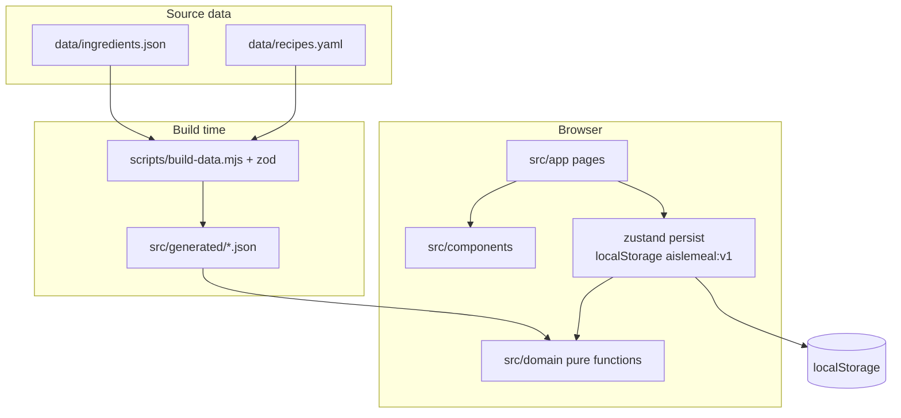

<p align="center">
  <a href="./README.md"></a>
  <a href="./README.en.md"></a>
</p>

# AisleMeal (货架健餐)

**Open-source healthy meal planner and grocery list generator** for people who cannot (or will not) design a week of meals. Tick the ingredients you already have, pick dishes you actually want, hit calorie and protein targets, then get a named shopping list. Static PWA: **no login, no backend, no prices, no grocery checkout**.

Chinese README: **[中文说明](./README.md)**.

[](LICENSE)
[](https://nodejs.org/)
[](docs/SPEC.md)
[](https://nextjs.org/)

## Contents

- [What it is](#what-it-is)
- [Flow](#flow)
- [Run locally](#run-locally)
- [Architecture](#architecture)
- [Repository layout](#repository-layout)
- [Routes](#routes)
- [Domain logic](#domain-logic)
- [Data and build](#data-and-build)
- [State, privacy, limits](#state-privacy-limits)
- [Tests and CI](#tests-and-ci)
- [Docs](#docs)

## What it is

AisleMeal is a **local-first meal prep** app for Chinese home cooking:

| Stuck on… | What AisleMeal does |
| --- | --- |
| How much should I eat to cut or bulk? | Targets from sex, age, height, weight, activity, goal |
| What can I cook with what I have? | Pantry ticks (or “common kitchen” preset) filter ~210 recipes |
| I cannot cook | At most 5 steps; equipment filters rice cooker / air fryer / microwave / stove |
| Shopping never matches the plan | After the nutrition gate, a **named grocery list** (packs rounded, pantry subtracted) |

Not a supermarket, meal-kit, delivery cart, or cloud calorie tracker.

**v0.6.0**: ~210 recipes, 205 generic ingredients (47 protein / 45 carb / 48 veg / 14 fat / 51 seasoning; seasonings collapsed by default). User data stays in `localStorage` key `aislemeal:v1` (persist **version 8**).

Search terms: meal planner, meal prep, grocery list, Chinese recipes, calorie/protein planning, pantry filter, local-first PWA, fat-loss / muscle-gain home cooking.

Out of scope: live inventory, prices, login, delivery, scraping grocery apps, medical-grade allergen testing.

## Flow

1. **Profile** — body stats, allergens, equipment, which meals you cook (skip breakfast or eat lunch out).
2. **My ingredients** — tick your own; optional common-kitchen preset. New users start empty.
3. **Inspiration** — add dishes to this week; default view is cookable with current ticks.
4. **Plan** — pick days; seed with wanted dishes; fill remaining slots easy vs variety.
5. **List** — generate only when daily kcal and protein are within **90–110%** of the **remaining (cooked-meal) target**.
6. **Cook** — follow steps; video link is a Bilibili search for “{name} 做法”.

Four tabs: Today, Plan, Shop, Ideas. Ingredient picking lives under Plan, not a fifth tab.

## Run locally

Node.js **20+**.

```bash
git clone https://github.com/bigu1/AisleMeal.git
cd AisleMeal
npm install
npm run dev
```

Open http://localhost:3000. `predev` / `prebuild` run `node scripts/build-data.mjs`.

```bash
npm test
npm run lint
npx tsc --noEmit
npm run build    # static files in out/
```

CI validates only; it does **not** auto-deploy a site.

---

## Architecture

All computation runs in the browser. No API routes, no database, no auth.



| Layer | Path | Role |
| --- | --- | --- |
| Pages | `src/app/` | App Router; mostly `"use client"` to read persist |
| UI | `src/components/` | Presentation; no nutrition formulas |
| State | `src/store/` | `useAppStore` + `persistMigrate` |
| Domain | `src/domain/` | **No React**. Nutrition, planner, shopping list, availability |
| Data | `data/` → `src/generated/` | YAML is parsed only in the Node script |
| Spec | `docs/SPEC.md` | Source of truth vs `docs/PLAN.md` |

`next.config.ts` sets `output: 'export'`. `GITHUB_PAGES=1` adds `basePath=/AisleMeal`; local `next dev` stays at `/`.

## Repository layout

```
data/                    human-edited ingredients + recipes
scripts/build-data.mjs   schema check, emit src/generated/
src/app/                 routes
src/components/          UI
src/domain/              pure functions + vitest
src/store/               zustand persist v8
src/generated/           build output, runtime reads this
docs/                    SPEC / PLAN / DECISIONS
.agent/                  multi-agent handoff
.github/workflows/ci.yml lint + test + export; no deploy
```

## Routes

| Route | Role |
| --- | --- |
| `/` | Today: enabled slots, primary CTA |
| `/onboarding` | 5-step profile; hides the tab bar |
| `/recipes` | Inspiration; `wantedRecipeIds` |
| `/recipes/[id]` | Steps, missing items; `?replace=` swaps one meal |
| `/plan` | Days, easy/variety, generate list behind the gate |
| `/basket` | My ingredients; custom items need `similarToId` to unlock recipes |
| `/shopping` | Named lists (max 8); check by ingredient id |
| `/cook` | `?day=&slot=` follow-along |

Default path: **profile → tick ingredients → want dishes → plan → kcal/protein gate → named list → cook.**

## Domain logic

### Nutrition (`nutrition.ts`)

- **BMR**: Mifflin-St Jeor (`10×kg + 6.25×cm − 5×age`, +5 male / −161 female).
- **TDEE**: BMR × activity (1.2 sedentary … 1.9 very active).
- **kcal**: goal factors 0.8 / 1.0 / 1.1, or a cut plan using 7700 kcal/kg if target weight + weeks are valid. Rounded to 10 kcal.
- **Floor**: 1200 female / 1500 male (`clampedToFloor`).
- **Protein**: 2.0 / 1.8 / 1.4 g/kg for cut / bulk / maintain.
- **Fat / carb**: reference only; **not** in the generate-list gate.
- **Slots**: 25% / 40% / 35% breakfast / lunch / dinner. Disabled slots fold (spread) or reserve (eat-out kcal). **A single enabled slot always reserves**, so two skipped meals are not jammed onto one plate.
- **Remaining target**: full target minus away estimate; the gate uses this and does not re-apply the kcal floor.
- Recipe macros: `per100g × grams/100` (raw weight).

### Planner (`planner.ts`)

Eligible recipes: equipment ⊆ profile; allergens/exclusions; every **non-seasoning** ingredient in the universe (seasonings may be unticked). Chicken breast/thigh/feet expand as one exclusion family.

`createMealPlan` fills `days` from the universe: wanted recipes first, then `easy` or `variety` (`REPEAT_BAND = 0.35`), then micro-adjust portions. Infeasible plans return add-ingredient suggestions.

### Gate (`nutritionGate.ts`)

Each day’s actual kcal **and** protein must sit in **90–110%** of the remaining target. Fat/carb only color the bars. No “generate anyway”.

### Shopping (`shoppingList.ts`)

Sum plan + micro-adjust grams, subtract pantry, `Math.ceil` to pack size. Grouped by category. Bulky packs are not split into retail loose weight.

### Availability (`availability.ts`)

`resolveUniverse` = ticked built-in ids ∪ custom `similarToId`. An empty basket is an empty universe (not the full catalog).

## Data and build

`data/ingredients.json` + `data/recipes.yaml` (max 5 steps) are validated by `scripts/build-data.mjs` (zod + referential integrity) into `src/generated/`. Runtime loads that JSON again in `src/domain/data.ts`.

**The original 53 `per100g` rows are locked** (`ingredientPer100g.lock.json`). Do not change those numbers.

## State, privacy, limits

zustand persist, name `aislemeal:v1`, **version 8**. Older catalog-mode baskets migrate to the common-kitchen preset; **new users get `basketIds: []`**.

Persisted: profile, ticks, custom ingredients, days, plan, style, wanted recipes, named lists, pantry. `scopeMode` is still stored but unused in UI.

Changing ingredients clears the plan and marks the active list stale. No accounts, no telemetry. Allergen labels are recipe-level, not lab tests. Nutrition is an estimate, not medical advice.

## Tests and CI

`npm test` — vitest, currently **174** cases (nutrition tables, planner, gate, shopping packs, persist migrate, data schema, copy). GitHub Actions: `build-data && lint && test && build`. No Pages deploy.

## Docs

| Doc | Role |
| --- | --- |
| [docs/SPEC.md](docs/SPEC.md) | Implementation spec |
| [docs/PLAN.md](docs/PLAN.md) | Product plan; SPEC wins conflicts |
| [docs/DECISIONS.md](docs/DECISIONS.md) | Engineering decisions |
| [AGENTS.md](AGENTS.md) | Facts for coding agents |
| [llms.txt](llms.txt) | Short summary for retrieval |

Read SPEC “out of scope” before changing formulas or the locked 53 `per100g` rows.

## License

[MIT](LICENSE)
