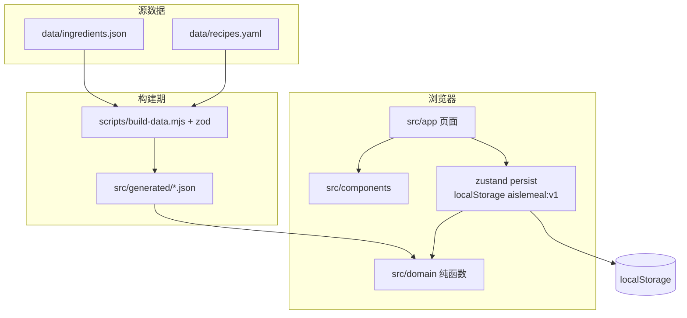

<p align="center">
  <a href="./README.md"></a>
  <a href="./README.en.md"></a>
</p>

# AisleMeal 货架健餐

**开源的健康餐备餐助手 + 采购清单生成器。** 勾选手头食材，选出想吃的菜，按热量和蛋白质排出三餐，再生成具名买菜清单。纯前端 PWA：无登录、无账号、无后端、无价格。

> English: [open-source healthy meal planner](./README.en.md) and grocery list for Chinese home cooking — calorie / protein targets, pantry-based recipes, local-only data.

[](LICENSE)
[](https://nodejs.org/)
[](docs/SPEC.md)
[](https://nextjs.org/)

## 目录

- [这是什么](#这是什么)
- [怎么用](#怎么用)
- [本地运行](#本地运行)
- [架构](#架构)
- [仓库目录](#仓库目录)
- [页面与路由](#页面与路由)
- [领域逻辑](#领域逻辑)
- [数据与构建](#数据与构建)
- [状态、隐私与限制](#状态隐私与限制)
- [测试与 CI](#测试与-ci)
- [文档](#文档)

## 这是什么

面向**不会做减脂餐 / 增肌餐、甚至连做饭都困难**的人：

| 卡点 | AisleMeal 怎么帮 |
| --- | --- |
| 不知道每天该吃多少 | 输入性别、年龄、身高、体重、活动量和目标，算出热量、蛋白质、脂肪、碳水 |
| 不知道该买什么、能做什么 | 在「我的食材」勾选手头有的（或一键常见厨房），灵感里加入本周想吃的，只推荐能做的菜 |
| 不会做饭 | 每道菜不超过 5 步；按你家厨具（电饭煲 / 空气炸锅 / 微波炉 / 灶）过滤 |
| 买完对不上餐单 | 营养达标后出**具名采购清单**，自动扣除家里已有，按包装取整 |

**AisleMeal 不做交易。** 清单给你，你自己去买，买回来照着做。不是超市 App，不是外卖，不是薄荷/Keep 那种云端饮食记录。

当前 **0.6.0**：约 **210** 道家常菜谱、**205** 种通用食材（蛋白 47 / 主食 45 / 菜 48 / 油脂 14 / 调味 51；调味默认折叠）。数据只留在本机浏览器 `localStorage`（键 `aislemeal:v1`，persist **version 8**）。

适合检索：健康餐规划、减脂餐、增肌餐、备餐、手头食材过滤菜谱、买菜清单、热量蛋白质、meal planner、grocery list、meal prep、Chinese home cooking、local-first PWA。

**不是：** 美团购物车、实时库存、价格比较、外卖下单、账号体系、医疗级过敏检测。

## 怎么用

1. **建档**：身体数据、忌口过敏、厨具、备哪几顿（早餐可以不吃，午餐可以在外）。
2. **我的食材**：自己勾选；可点「常见厨房预勾」。新用户默认空篮。
3. **灵感**：把想吃的加入本周；默认只看已勾食材能做的。
4. **排出餐单**：选天数，用这几道铺满要备的餐位，其余按「省事」或「换花样」补。
5. **生成清单**：每天热量和蛋白相对**备餐剩余目标**落在 **90%–110%** 之后，才允许生成采购清单。
6. **开做**：按天看步骤；教学链跳到 B 站搜索「菜名 做法」。

底栏四个入口：今天 · 餐单 · 买菜 · 灵感。「我的食材」从餐单进去，不是每天目的地。

## 本地运行

需要 **Node.js 20+**。

```bash
git clone https://github.com/bigu1/AisleMeal.git
cd AisleMeal
npm install
npm run dev
```

打开 http://localhost:3000 。`predev` / `prebuild` 会跑 `node scripts/build-data.mjs`。

```bash
npm test             # vitest：营养 / 排餐 / 清单 / 数据 / persist
npm run lint
npx tsc --noEmit
npm run build        # 静态产物在 out/（gitignore）
```

无服务器用户数据。CI 只跑校验，不自动部署网站。

---

## 架构

纯前端、可静态导出。浏览器里跑完所有计算；没有 API route、没有数据库、没有登录。



分层约定：

| 层 | 路径 | 职责 |
| --- | --- | --- |
| 页面 | `src/app/` | Next.js App Router 路由；几乎都是 `"use client"`，因为要读 persist |
| UI | `src/components/` | 无业务公式；营养条、天数、底栏、空态 |
| 状态 | `src/store/` | `useAppStore`：档案、已选食材、餐单、具名清单；`persistMigrate` 升版本 |
| 领域 | `src/domain/` | **不依赖 React**。营养、排餐、清单、可得性、过敏展开 |
| 数据 | `data/` → `src/generated/` | YAML/JSON 源文件只在 Node 脚本里解析；运行时 import 生成后的 JSON |
| 规格 | `docs/SPEC.md` | 实施唯一来源；与 PLAN 冲突听 SPEC |

请求路径上没有后端。`next.config.ts` 里 `output: 'export'`，产物是静态 HTML/JS。`GITHUB_PAGES=1` 时才加 `basePath=/AisleMeal`，本地 dev 仍是 `/`。

## 仓库目录

```
AisleMeal/
├── data/                    # 人读的源：食材 JSON、菜谱 YAML
├── scripts/build-data.mjs   # 校验 schema、写 src/generated/
├── src/
│   ├── app/                 # 路由页（见下表）
│   ├── components/          # 展示组件
│   ├── domain/              # 纯函数 + vitest
│   ├── store/               # zustand + persist v8
│   ├── generated/           # 构建产物，运行时只读这里
│   ├── lib/                 # 天数、中文标签
│   └── hooks/
├── public/                  # PWA manifest、图标
├── docs/                    # SPEC / PLAN / DECISIONS
├── .agent/                  # 多 AI 交接（STATE / handoff）
├── .github/workflows/ci.yml # lint + test + 静态导出，不 deploy
├── AGENTS.md                # 给编码代理的仓库事实
└── llms.txt                 # 给检索/代理的短摘要
```

## 页面与路由

底栏四栏；`/onboarding` 隐藏底栏。`/cook`、`/basket` 不占第五栏。

| 路由 | 作用 |
| --- | --- |
| `/` 今天 | 当天已备餐位、主 CTA（去选菜 / 生成清单 / 去买菜 / 去做某顿） |
| `/onboarding` | 五步建档：身体数据 → 活动与目标 → 过敏忌口 → 厨具 → 估算 + 备哪几顿 |
| `/recipes` 灵感 | 筛选厨具/已有食材/时长；「加入本周」写入 `wantedRecipeIds` |
| `/recipes/[id]` | 步骤、缺料、B 站搜索；`?replace=` 只换一餐 |
| `/plan` 餐单 | 天数、省事/换花样、排出、换一道、营养条；门闩过了才能「生成采购清单」 |
| `/basket` 我的食材 | 分类勾选、常见厨房预勾、自定义（营养必须近似内置；`similarToId` 才解锁菜） |
| `/shopping` 买菜 | 活跃具名清单；勾选按食材 id；可另存最多 8 份 |
| `/cook` | `?day=&slot=` 跟做 |

主路径：**建档 → 勾食材 → 灵感加入本周 → 排出 → 热量+蛋白门闩 → 具名清单 → 跟做。**

## 领域逻辑

都在 `src/domain/`，页面只组参数、展示结果。

### 营养 `nutrition.ts`

- **BMR**：Mifflin-St Jeor。`10×kg + 6.25×cm − 5×岁`，男 `+5`，女 `−161`。
- **TDEE**：BMR × 活动系数（久坐 1.2 … 非常活跃 1.9）。
- **目标热量**：减脂/维持/增肌再乘 `0.8 / 1.0 / 1.1`；若减脂填了目标体重和周数，改用 `7700 kcal/kg` 算日赤字。结果四舍五入到 10 kcal。
- **安全下限**：女 1200 / 男 1500 kcal，低于则钳住并标 `clampedToFloor`。
- **蛋白质**：减脂 `2.0`、增肌 `1.8`、维持 `1.4` g/kg。
- **脂肪 / 碳水**：脂肪至少 `max(热量×25%/9, 0.8×kg)`，剩下给碳水；只作参考，**不进门闩**。
- **餐位**：早/午/晚默认热量比 `25% / 40% / 35%`。不备的槽可以「不吃」(fold，预算摊到其余顿) 或「在外」(reserve，扣掉一笔估算)。**只备一顿时 fold 也按 reserve**，避免把两顿并进一盘。
- **备餐剩余目标** `remainingTarget`：全日目标减去在外估计，再按比例切蛋白脂肪碳水。门闩对照这个，不再套一遍热量下限。
- 菜谱营养：配料 `per100g × 克数/100` 相加（生重）。

### 排餐 `planner.ts`

- 候选：厨具必须是档案的子集；过敏/忌口命中则淘汰；已选宇宙里**非调味**都要有（调味可免勾）。
- 忌口鸡胸/鸡腿/鸡爪运行时当成一组（`exclusionFamily.ts`）。
- `createMealPlan`：用当前宇宙排出 `days` 天；先铺 `wantedRecipeIds`，其余按 `planStyle`（`easy` 省事 / `variety` 换花样）；重复惩罚 `REPEAT_BAND = 0.35`。
- 排完用微调件（酸奶、牛奶、乳清等）补热量蛋白。
- 不可行则返回补充建议，不编造做不了的菜。

### 清单门闩 `nutritionGate.ts`

对每一天的 `dailyActual` vs **剩余目标**：热量和蛋白都必须在 **90%–110%**。脂肪碳水只影响营养条颜色（ok / warn / danger），不能绕过「生成采购清单」。没有「仍要生成」。

### 买菜 `shoppingList.ts`

把餐单 + 微调件的克数加总，减去 `pantry`，再按食材 `pack.size` **向上取整**。大包装声明不拆零售。按蛋白/主食/菜/油脂/调味分组。

### 可得性 `availability.ts`

`resolveUniverse(basketIds, customIngredients)` = 勾选的内置 id ∪ 自定义里填了 `similarToId` 的等同 id。空篮就是空宇宙，不会回落到全库。

## 数据与构建

| 文件 | 内容 |
| --- | --- |
| `data/ingredients.json` | id、通用名、分类、`per100g`、包装、储存、过敏、来源、popularity |
| `data/recipes.yaml` | id、餐位、厨具、时长、难度 1–2、配料克数、**最多 5 步**、标签 |
| `scripts/build-data.mjs` | zod 校验、引用完整性、写出 `src/generated/` |
| `src/domain/ingredientPer100g.lock.json` | **原 53 条营养数值锁死**，测试禁止改 |

运行时 `src/domain/data.ts` 再 parse 一次生成文件。菜谱步骤不可执行（例如微波生米）属于数据问题，不在构建脚本里修逻辑。

## 状态、隐私与限制

`src/store/useAppStore.ts`：zustand + persist。

- 键名 **`aislemeal:v1`**，**version 8**。v7 及更早、且当时是 catalog 模式的篮，迁移时会变成「常见厨房」预勾；**新用户默认 `basketIds: []`**。
- 持久化：档案、已选食材、自定义食材、天数、餐单、排餐偏好、本周想吃的、具名清单、家里已有。`scopeMode` 仍写入但是死字段（UI 已去掉「按店内目录」）。
- 改食材会清掉当前餐单，并把活跃清单标过期。
- 无账号、无遥测、无第三方分析。身体数据不离开这台浏览器。
- 过敏按常见配方标，未化验；酱料未逐道拆；芝麻未列入。营养是估算，不是医疗建议。

## 测试与 CI

`npm test` 跑 vitest，覆盖营养表、排餐可行性、门闩、清单取整、persist 迁移、数据 schema、文案诚实性等（当前 **174** 条）。GitHub Actions：`build-data && lint && test && build`。不发布 Pages、不 `wrangler`。

## 文档

| 文档 | 用途 |
| --- | --- |
| [docs/SPEC.md](docs/SPEC.md) | 实施规格，编码以它为准 |
| [docs/PLAN.md](docs/PLAN.md) | 产品规划；冲突听 SPEC |
| [docs/DECISIONS.md](docs/DECISIONS.md) | 实现决策 |
| [AGENTS.md](AGENTS.md) | 给 Cursor / Codex / Grok 的仓库事实 |
| [llms.txt](llms.txt) | 给检索代理的短摘要 |

欢迎 fork。改营养公式或 53 条 `per100g` 前请先读 SPEC「明确不做」。

## License

[MIT](LICENSE)
