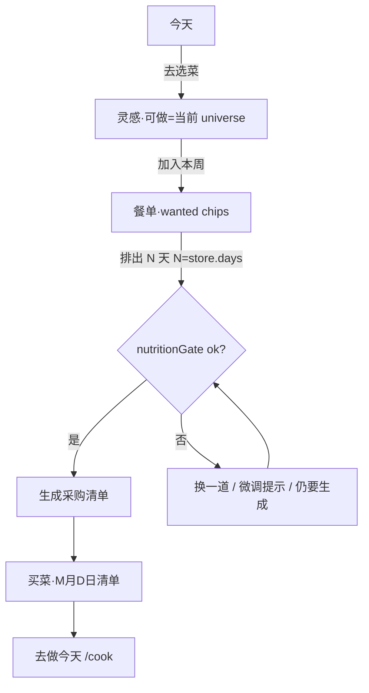

# AisleMeal 0.3 体验重构设计

| 字段 | 值 |
|---|---|
| 标题 | 先选想吃的，再用附近可买食材过滤，营养达标后出采购清单 |
| 作者 | Grok Build（设计稿；未改仓库） |
| 日期 | 2026-08-20 |
| 状态 | Draft（评审修订 2） |
| 目标版本 | **0.3**（仓库 semver / `package.json`；**不是** `docs/PLAN.md` 旧「V0.3 美团链接+社区化」） |
| 仓库现状 | Phase 1：persist `aislemeal:v1` **version 5**，192 食材 / 121 食谱（早餐 33 / 午晚餐双槽 88），底栏 今天/餐单/买菜/灵感 |
| 实施源 | **`docs/SPEC.md` 仍是仓库唯一实施源**（AGENTS.md）。0.3 倒置写进 SPEC **PR0（功能码之前）**；公式 §4–7 不动。本文是给 SPEC 的设计输入，不是长期凌驾 SPEC 的第二份规格。 |
| 视觉 | 继续 **Leaf & Yuzu**（Q8）。无 `PRODUCT.md` / `DESIGN.md`。产品壳 Operate 模式。 |

**已冻结、编码勿再问：** 主路径倒置（先选菜）。老大 brief 即最终决定。PLAN「食材驱动为主」改为辅助。不要把倒置再标成 Open Question。

---

## Overview

Phase 1 主路径仍是 **先装篮、再看能做什么**（`/basket` → `eligibleRecipes(..., basketIds)` → `/plan` → `/shopping`）。0.3 反过来：先决定这周想吃什么，系统用「附近能买到的食材」（已采集的小象静态目录）过滤可做菜，营养达标后生成**具名采购清单**。

0.3 是产品经验重构，不是重写 Next.js、不是后端、不是爬虫：

1. **可得性源抽象**（stub = 小象静态目录）。匹配只吃 `Set<string>` universe，不读 `capture.json`。
2. **主路径挑菜**：灵感加入本周 → 餐单按 wanted 铺餐位、其余 easy/variety 补 → 营养门闩 → 具名清单。
3. **三个已验证的洞**：档案只能 `resetAll`；「家里已有食材」无搜索且宇宙 192；底栏选中只有描边变色。
4. **食谱 121 → [200, 250]**，新菜不依赖 fail-close 11。

保持：四栏、开做非 Tab、厨具 AND、全厨具默认、Leaf & Yuzu、`REPEAT_BAND=0.35`、persist **键名** `aislemeal:v1`、53 条 `per100g`、fail-close 11 原名。persist **version 5 → 6**（具名清单 + `scopeMode` + `wantedRecipeIds`）。cookProgress 若做，用 **v7**。

---

## Background & Motivation

### 当前闭环（代码事实）

```
建档 /onboarding
  → 装篮 /basket（篮子 ⊆ 才能做）
  → 确认 → /plan 贪心排餐（easy / variety）
  → /shopping 扣 pantry、包装取整、勾选 shoppingChecked
  → /cook?day=&slot=
```

| 点 | 现状 | 文件 |
|---|---|---|
| 匹配 | `eligibleRecipes`：非调味 ⊆ `basketIds`；调味豁免；过敏/不吃；`recipe.equipment ⊆ profile.equipment` | `src/domain/planner.ts` |
| 微调 | `applyMicroAdjust`：仅当 `ctx.basketIds` 存在时跳过 fail-close 11；**缺 basketIds 时会选希腊酸奶/脱脂奶/乳清** | `planner.ts` 331–337 |
| 还缺 | `missingNonSeasoningIds(..., basketIds)` | `src/domain/recommend.ts` |
| 一键篮 | 排除 fail-close 11；已勾非 fail-close（含加工肉）保留 | `suggestHealthyBasket` |
| 排餐 | `easy` ≡ HEAD 21 ids；`variety` 用 `REPEAT_BAND=0.35` | `pickRecipeId` |
| 清单 | `buildShoppingList` 扣 pantry；勾选 `shoppingChecked` | `shoppingList.ts`，`shopping/page.tsx` |
| 持久化 | 键 `aislemeal:v1`，`version: 5`，`partialize` 含 `shoppingChecked`；`setPlan` 写成 `{}` | `useAppStore.ts` |
| 底栏 | `/` 今天 · `/plan` 餐单 · `/shopping` 买菜 · `/recipes` 灵感；`/cook`→今天；`/basket`→餐单 | `BottomNav.tsx` |
| 货源 | 「单店货架快照（已作废） · 已采集目录 / 不代表实时库存」 | `StoreSourceBanner.tsx` |
| 数据 | 192 食材、**121** 食谱（**早餐 33** / **午晚餐双槽 88**）；`capture.json` **610 个 SKU**（约 3066 行），`capturedAt: 2026-08-19`，poi（已删） | `data/` |
| 天数默认 | `DEFAULT_DAYS = 3`（不是 7；HEAD 7 天是测试夹具） | `useAppStore.ts` |

`docs/PLAN.md` 食材驱动为主。`docs/SPEC.md` §8 仍是装篮流程。今天无餐单主 CTA「去配餐」→ `/basket`（`src/app/page.tsx` `primaryCta`）。

`shoppingChecked` 调用点（PR2 必须全改）：`src/app/shopping/page.tsx`、`src/app/page.tsx`（买菜 m/n + `shoppingDone`）、`src/store/useAppStore.ts`、`src/store/persistMigrate.ts`。`src/domain/recommend.test.ts` **写死** `version: 5`。

### 痛点

1. **心智反了。** `RecipeDetail.fillBasket` 并篮后跳 `/basket`，不能直接出清单。
2. **档案不能改。** 只有「重新建档」→ `resetAll()`（`page.tsx` 215–224，**无 confirm**）。onboarding 空 `useState`，`submit` → `/basket`。
3. **家里已有找不到。** pantry sheet 无搜索，宇宙全 192；页级搜索只管货架；sheet `z-40` 盖住页面。
4. **买菜怕丢。** 勾选刷新还在；`setPlan` 清空；只有一份 map。
5. **底栏选中太弱。** 仅 brand 色 + `strokeWidth` 2 vs 1.75。
6. **121 道不够撑先选菜。** 早餐大量 fail-close 燕麦/希腊酸奶。

### 明确不在 0.3

美团/外卖抓取、登录、购物车、价格、账号、后端、改 53 条 `per100g`、改 fail-close 11 原名、改 `.agent/handoff`、改 persist **键名**、开做回底栏、桌面双栏、cookProgress、PLAN 旧 V0.3 的社区 PR 流程与分享链接解析。

---

## Goals & Non-Goals

### Goals

- 主路径：**挑菜 → 可买过滤 → 营养达标 → 具名采购清单**。
- 可买走 `resolveUniverse`；0.3 stub = 小象静态目录。
- 至多一份 `status=active` 清单 + 合计最多 8 份；勾选跨刷新保留；新生成默认不毁掉未买完的旧勾选。
- 档案可编辑，不强制 `resetAll`。
- pantry 可搜索；可新加的只有菜谱引用食材 + 全部调味；孤儿只展示已有的。
- 底栏 375px 一眼能看出选中；`aria-current` 逻辑不动。
- 食谱数 ∈ **[200, 250]**；新菜非调味 ⊆ catalog 且不含 fail-close。
- 每条 PR：`npm test && npm run lint && npx tsc --noEmit`。

### Non-Goals

- 实时库存、多源粘贴、价格、OCR、爬虫。
- 改 `nutrition.ts` 公式 / T1 T2 T3。
- 改 `REPEAT_BAND`、厨具 AND、D-023 连吃、D-025 脂肪碳水条。
- 第五栏、`/cook` 进 Tab、灵感大推荐卡、名实不符润色、SW。

---

## Key Decisions

1. **主路径倒置，篮子降为可选。** 默认 `scopeMode: "catalog"`。不是推翻 Q1 四栏。PLAN「食材驱动为主」改为辅助。**PR0 先改 SPEC §8 并 `handoff decide`，再写匹配 UI。**
2. **「能做」= universe ∩ 档案约束，不是 pantry。** pantry 只扣采购克数。
3. **营养门闩卡「生成清单」，不卡 `createMealPlan` 可行性**（D-023）。门闩 = 每天热量+蛋白落在目标 90–110%（微调后）。脂肪/碳水不进门闩（D-025）。次要「仍要生成清单」。
4. **具名清单，persist v6，键名仍 `aislemeal:v1`。** 清单是**不可变快照**。默认名「M月D日清单」。上限 8。
5. **档案入口在今天「档案」→ `/onboarding?edit=1`。** 不新增 Tab。保存不 `resetAll`。PR4 只 `resetPlan`；`recomputeMicro` 等 PR6。
6. **pantry 宇宙 = 菜谱引用 id ∪ 全部调味 ∪ 当前 pantry 孤儿。** 搜索在 sheet 内。页级「搜索食材」仍只管货架（D-030）。
7. **食谱目标 [200, 250]。** 新菜禁止 fail-close；禁止新水果酸奶杯。原 53 `per100g` 不动。
8. **底栏选中：pill + 柚子顶条，图标不 fill。** 四栏不动。
9. **wanted 排程用方案 A（不是贪心打分优先）。** 每个餐位：若有可做的 wanted，按该餐位 `wantedUsedCount` 升序取一道；该餐位没有 wanted 时，对剩余可做池走现有 easy/variety。CTA：「用这几道铺满能对上的餐位，其余按省事/换花样补」。
10. **cookProgress 不进 v6。** 用 v7。
11. **universe 唯一公式（无散文例外）：**
    ```
    catalogMode: catalogIds(snapshot)                 // fail-close 已排除
    basketMode:  (catalogIds ∩ basketIds) ∪ (basketIds ∩ FAIL_CLOSE_IDS)
    seasoning:   永不要求出现在 universe
    ```
    `inCatalog` **运行时精确匹配** `ingredient.name ∈ capture.skus[].name`（与 `data.test.ts` `storeNames.has(item.name)` 一致）。fail-close 11 **强制** `inCatalog: false`。`ingredientHint` 只用于写新食材时判断「近义」，不参与运行时匹配。
12. **领域函数只吃显式 `universe: Set<string>`，不读 `scopeMode`。** `createMealPlan` / `applyMicroAdjust` / `suggestAdditions` / `missingNonSeasoningIds` 全部如此。微调份 ⊆ universe（catalog 下自然不会出希腊酸奶）。HEAD 测试传入 `DEFAULT_BASKET_IDS` 当 universe。
13. **清单不变量：** 至多一条 `status=active`；`activeShoppingListId` 指向它或 null。`换一道`/`patchPlan` 只打 `stale=true`，不改 items。无活跃清单时今天 CTA 是「去餐单生成清单」。没有空白「+」；新清单只来自生成/另存。第 9 份：确认归档 `updatedAt` 最早的一条。
14. **离开 basket 模式：餐单和货架上的持久开关「按店内目录 | 只用本周货架」。** 灵感「只看可做」跟 **当前排餐 universe**，不是永远 catalog。`DEFAULT_BASKET_IDS`（含 oats、greek-yogurt）**不是**合法 0.3 basket 宇宙；basket 模式请用「帮我配一篮」（已排除 fail-close）。
15. **SPEC/PLAN 在 PR0 更新，不等 200 道菜。** 仓库 `0.3.0` ≠ PLAN 旧 V0.3 社区化。
16. **营养带判断在 `nutrition.ts` 的 `inTargetBand`。** `barTone` 只是它的 UI 包装。领域禁止 import `MacroBars`。

---

## Proposed Design

### 信息架构（四栏保留）

不改 `TABS` href/label。改无餐单时的主 CTA 和职责。

| Tab | 路由 | 0.3 职责 |
|---|---|---|
| 今天 | `/` | 今日三餐、营养折叠、档案、主 CTA（见下表） |
| 餐单 | `/plan` | wanted chips、排出、换一道、营养门闩、生成清单、scopeMode 开关。`/basket` 仍算本 Tab |
| 买菜 | `/shopping` | 活跃具名清单 + 切换已存 |
| 灵感 | `/recipes` | 挑菜库；默认可做=当前 universe。详情 `/recipes/[id]` |

`/cook?day=&slot=`、`/onboarding`、`/basket` 保留。`/onboarding` 隐藏底栏。

今天无档案：「开始建档」→ `/onboarding`。

#### 今天主 CTA（有档案）

| 状态 | href | 文案 |
|---|---|---|
| 无可行餐单 | `/recipes` | 去选菜 |
| 可行餐单、无活跃清单 | `/plan` | 去餐单生成清单 |
| 活跃清单、非调味未勾完 | `/shopping` | 去买菜 |
| 活跃清单已买完（非调味全勾，或清单空因为 pantry 扣光） | `/cook?day={planDayIndex}&slot=breakfast` | 去做早餐 |

**今天 CTA 启用时机：** 上表是 **PR8 终态**。PR2–PR7 期间继续用现在的 `primaryCta`（有可行 plan 且买菜未完 → `/shopping`；买完 → `/cook`）。PR2 的 m/n 与 `shoppingDone` 按下文「PR2–PR8 购物行契约」用 **live 行 + list 勾选**，禁止用空 `list.items` 判买完。

次要：「改本周货架」→ `/basket`。PR8 起不要在「有 plan 无清单」时写「去买菜」。

### 用户旅程



1. 灵感默认「只看可做」= `cookableRecipes(..., resolveUniverse(...))`。
2. 「加入本周」写 `wantedRecipeIds`。餐单「用这几道铺满能对上的餐位…」走方案 A。
3. `days` 用 store（默认 **3**，不是写死 7）。按钮文案 ``用这几道排出 ${days} 天``。
4. 门闩绿 →「生成采购清单」。已有活跃且未勾完 → 覆盖 / 另存。
5. 勾选写进该清单快照。

#### 空态

| 场景 | 页面 | 主按钮 |
|---|---|---|
| 无档案 | `/` `/plan` `/shopping` `/cook` | 去建档 |
| 有档案、**无 wanted 且无 plan** | `/plan` **不整页早退**；强调旁路「去选想吃的」→ `/recipes` | 排出按钮仍在，无 wanted 时也可排出（走 catalog/basket universe 的 easy/variety） |
| 有档案、**有 wanted、无 plan** | `/plan` 照样画 chips + 排出，**禁止** EmptyState 送回灵感 | 「用这几道排出 `${days}` 天」 |
| 有可行 plan、无任何清单 | `/shopping`（PR8 起）**和** 今天（PR8 起） | 去餐单生成清单 → `/plan` |
| 可做池某餐位 0 道 | 灵感/餐单 | 改档案（厨具/过敏） |
| wanted 全不可做 | chips「无法做」；排出 **disabled** | 旁路「去选想吃的」 |

**`/plan` 有 profile 时禁止** `if (!plan) return <EmptyState/>`（现状 `plan/page.tsx` 59–67）。固定骨架见「餐单页结构」。

#### 营养未达标

- `plan.feasible === true` 仍可看餐单。
- 主按钮 disabled，文案用 `nutritionGate.reasons` 原文（已是「第 2、5 天热量偏高」这种 1-based）。
- 次要「仍要生成清单」（`--color-warn`）。生成后买菜 banner：「营养未按目标，仅按当前餐单买菜」。

#### 菜做不了（缺 SKU）

相对 **当前 universe**（不是永远 catalog）：

| missing 非调味 | 徽章 |
|---|---|
| 空 | 可做 |
| 全部 `!inCatalog` 或 fail-close（且该 id ∉ universe） | 店里暂无 |
| catalog 有、但 basket 模式未勾 | 还缺货架范围 |

详情列出缺的 id（`shortName` + 货架 `name`）。「加入本周」disabled。不调用 `fillBasket`。可看步骤和 B 站链。`?replace=` 模式：只保留「只换这一餐」，**隐藏**加入本周。

### 可得性源

文件：`src/domain/availability.ts`，`src/generated/availability.json`，`src/generated/catalog-ids.json`（`inCatalog===true` 的 id 数组，给写菜的人当白名单）。`scripts/build-data.mjs` 生成。运行时 **不要** import 610 个 SKU 的 `capture.json`。

构建期每个 ingredient：

- `inCatalog = storeNames.has(ingredient.name)`
- fail-close 11 强制 `false`
- `capturedAt` 抄 capture 根字段
- stdout：`inCatalog true/false 计数` + 打印 catalog id 列表（或只写文件）

**PR1 不得**把餐位覆盖从 5 改到 40（当前早餐 33，会红）。

```ts
export type AvailabilitySourceId = "retired-store-snapshot";

export interface AvailabilityItem {
  ingredientId: string;
  inCatalog: boolean;
}

export interface AvailabilitySnapshot {
  sourceId: AvailabilitySourceId;
  storeLabel: string; // 单店货架快照（已作废）
  capturedAt: string; // 2026-08-19
  items: AvailabilityItem[];
}

export interface AvailabilitySource {
  readonly id: AvailabilitySourceId;
  load(): AvailabilitySnapshot;
}

/** fail-close 已排除 */
export function catalogIds(snapshot: AvailabilitySnapshot): Set<string>;

export function resolveUniverse(
  snapshot: AvailabilitySnapshot,
  scopeMode: "catalog" | "basket",
  basketIds: readonly string[],
  failCloseIds: readonly string[] = FAIL_CLOSE_IDS,
): Set<string> {
  const catalog = catalogIds(snapshot);
  if (scopeMode === "catalog") return catalog;
  const basket = new Set(basketIds);
  const out = new Set<string>();
  for (const id of catalog) if (basket.has(id)) out.add(id);
  for (const id of failCloseIds) if (basket.has(id)) out.add(id);
  return out;
}
```

UI/store 调 `resolveUniverse`；`planner.ts` 只收 `universe`。

餐单 + 货架：`role="radiogroup"` 两项「按店内目录」|「只用本周货架」，写入 `scopeMode`。切到 basket 时若当前篮仍是默认 9 样（含 fail-close），hint：「默认 9 样含店内没有的燕麦/希腊酸奶，早餐会排空。请用帮我配一篮，或改回店内目录。」

灵感「只看可做」的过滤集 = `resolveUniverse` 的同一结果。

### 匹配算法

```ts
export function cookableRecipes(
  recipes: Recipe[],
  profile: UserProfile,
  ingredients: Ingredient[],
  universe: Set<string>,
): Recipe[] {
  const byId = byIdMap(ingredients);
  return recipes.filter((recipe) => {
    if (!recipe.equipment.every((eq) => profile.equipment.includes(eq))) return false;
    if (!recipeAllowedByProfile(recipe, profile, ingredients)) return false;
    return recipe.ingredients.every((row) => {
      const ing = byId.get(row.id);
      return ing?.category === "seasoning" || universe.has(row.id);
    });
  });
}
```

```ts
export interface PlanContext {
  profile: UserProfile;
  ingredients: Ingredient[];
  universe: Set<string>;       // 必填。tsc 会在所有 createMealPlan/applyMicroAdjust/replaceMeal/alternativesFor 调用点红
  wantedRecipeIds?: string[];
  planStyle?: PlanStyle;
}
```

`createMealPlan`：

```
candidates = cookableRecipes(allRecipes, profile, ingredients, ctx.universe)
buildPlan(candidates, ..., ctx)
```

**禁止**在 planner 内读 `scopeMode` 或「若有 basketIds 则旧行为」。旧 `eligibleRecipes(..., basketIds)` **保留**给一键篮候选过滤（Mode A 工具），但 **`createMealPlan` 仍必须带 universe**。

#### `universe` 传什么（抄这段，不要猜）

| 调用方 | universe | 禁止 |
|---|---|---|
| 一键篮 `suggestHealthyBasket` 的 `feasible(ids)` / 内部 `createMealPlan` | `new Set(ids)`（**正在评估的候选篮**） | `catalogIds` / `resolveUniverse(catalog)` |
| `previewHealthyBaskets` → 同上 | 该 style 的 `preview.ids` | catalog |
| `computeBasketFeedback` / 货架页试排 | `new Set(basketIds)` | catalog |
| HEAD / 默认 9 样测试 | `new Set(DEFAULT_BASKET_IDS)` | — |
| catalog 7 天可行测试 | `catalogIds(snapshot)` | 默认 9 |
| `applyMicroAdjust` 现有 whey 用例（`planner.test.ts` 约 133–279） | universe **必须含** `whey-protein`（及测试里断言会出现的份） | 空 universe / 纯 catalog（会 0 份，测红） |
| PR6–PR7 的 UI（`plan/page.tsx`、RecipeDetail replace） | `new Set(basketIds)`（过渡，行为≈今天） | 等 PR8 再 `resolveUniverse(scopeMode, basketIds)` |
| PR8 起餐单排出 / 换一道 / 灵感可做 | `resolveUniverse(snapshot, scopeMode, basketIds)` | 一键篮仍用候选篮 id |

#### PR6 必须改到的调用点（漏一个 tsc 红）

领域：

- `src/domain/planner.ts` — `PlanContext`、`createMealPlan`、`applyMicroAdjust`、`replaceMeal`、`alternativesFor`、`suggestAdditions`
- `src/domain/planner.test.ts` — 所有 `createMealPlan` / `applyMicroAdjust` / `replaceMeal` ctx
- `src/domain/basketFeedback.ts` — `createMealPlan({ universe: new Set(basketIds), ... })`
- `src/domain/basketFeedback.test.ts`
- `src/domain/recommend.ts` — `suggestHealthyBasket` / `previewHealthyBaskets` 内 **每一处** `createMealPlan`（约 196–207、298、394–408、470）
- `src/domain/recommend.test.ts`
- `src/domain/data.test.ts` — 约 195–197
- `src/domain/nutrition.ts` + `src/components/MacroBars.tsx` — `inTargetBand`
- `src/domain/nutritionGate.ts` + 测试（新）

UI（否则 `plan/page.tsx` tsc 红；**不算「大 UI」**，只补 ctx 字段）：

- `src/app/plan/page.tsx` 76–104：`ctx = { profile, ingredients, universe: new Set(basketIds), planStyle }`；`createMealPlan` / `replaceMeal` / `alternativesFor` 吃同一 ctx。**本 PR 不改 EmptyState、不加 chips。**
- `src/app/recipes/[id]/RecipeDetail.tsx` 118–126：`replaceMeal` 的 ctx 加 `universe: new Set(basketIds)`。**本 PR 不删 `fillBasket`（PR7 删）。**

store：`wantedRecipeIds` / `scopeMode` sanitize 默认（PR2 已 v6 则不要 `if (version < 6)`）。

`applyMicroAdjust`：删除「`if (ctx.basketIds) 跳过 fail-close`」。改为：

```
if (!ctx.universe.has(portion.ingredientId)) continue;
```

（universe 已按公式处理 fail-close。）香蕉等仍在 catalog 则可补。

`suggestAdditions`：解锁计算用 `universe ∪ {candidateId}`，不要用 basketIds。

`missingNonSeasoningIds(recipe, universe, ingredients)`：非调味且 `!universe.has(id)`。灵感「还缺 N」和详情徽章都走它。**删除**详情 `fillBasket` → `setBasketIds` + `setPlan(null)` + `/basket`。可做则加入本周；缺 SKU 则 disabled。

能做表：

| 条件 | 规则 |
|---|---|
| 店内/本周货 | 非调味 ∈ universe |
| 调味 | 不要求 ∈ universe，仍进采购清单 |
| 过敏/不吃 | `recipeAllowedByProfile` |
| 厨具 AND | `recipe.equipment ⊆ profile.equipment`；`[]` 恒可 |
| 加工肉 | 能做；排名仍罚；一键篮不自动加 |
| pantry | 不影响能做 |

#### wanted 方案 A（`pickRecipeId`）

额外维护 `wantedUsed: Record<MealSlot, Map<string, number>>`（与现有 variety 的 `used[slot]` 分开，避免污染 HEAD easy）。

每个 `(day, slot)`：

```
pool = candidates.filter(mealSlots 含 slot)
wantedPool = pool.filter(id ∈ wantedRecipeIds)
if (wantedPool.length > 0):
  按 (wantedUsed[slot].get(id) 升序, scoreRecipe 升序, id 字典序) 取第一道
  wantedUsed[slot][id] += 1
  同时照常更新 used[slot]（variety 后续 leftover 要用）
else:
  现有 pickRecipeId(pool, style, used[slot])   // easy 最低分 / variety REPEAT_BAND
```

含义：某餐位有能做的 wanted → **该餐位全部天数都从 wanted 里轮换**，不会在有 wanted 早餐时改去打分第一的非 wanted。某餐位一个 wanted 都没有 → 整段 leftover 走 easy/variety。

双槽（`lunch, dinner`）：午餐、晚餐 **各自**一份 usedCount。只有 1 道 wanted 正餐时，它可以铺满 14 格——这是「用这几道铺满能对上的餐位」，不是 bug。有 2 道 wanted 正餐则各餐位内轮换。

chips 徽章（一道菜一张 chip，可双槽；**不要按餐位猜**）：

```ts
function wantedChipBadge(
  id: string,
  cookableIds: Set<string>,
  plan: MealPlan | InfeasiblePlan | null,
): "无法做" | "未排上" | null {
  if (!cookableIds.has(id)) return "无法做";
  if (plan && plan.feasible === true) {
    const used = plan.meals.some((m) => m.recipeId === id);
    return used ? null : "未排上";
  }
  return null; // 排出前：能做的 chip 无徽章
}
```

规则：排出后 `!cookable` →「无法做」；cookable 且 `plan.meals` 无该 id →「未排上」；否则无徽章。排出前只标「无法做」。早餐 wanted 不因没上晚餐而标未排上。

**可行性仍不看 wanted。** 无任何可做早餐 → `no_recipes_for_slot`。

HEAD 回归：`wantedRecipeIds=[]` 且 `universe=DEFAULT_BASKET_IDS` → 21 ids 不变。

新增：`universe=catalogIds`、T1 全厨具、7 天 → `feasible===true`（**不断言** nutritionGate；那是另一张测试）。

新增：3 道可做 wanted 早餐 + easy + 7 天 → **至少 2 个不同** wanted 早餐 id；`days>=3` 时 **3 个都至少出现 1 次**。

### 营养门闩

**禁止**从 `src/domain/*` import `src/components/MacroBars.tsx`。

`src/domain/nutrition.ts`（`barTone` 改为调用这里）：

```ts
export const TARGET_BAND = { lo: 0.9, hi: 1.1 } as const;

export function inTargetBand(actual: number, target: number): boolean {
  const goal = target || 1;
  const ratio = actual / goal;
  return ratio >= TARGET_BAND.lo && ratio <= TARGET_BAND.hi;
}

export function bandSide(actual: number, target: number): "ok" | "low" | "high" {
  const goal = target || 1;
  const ratio = actual / goal;
  if (ratio < TARGET_BAND.lo) return "low";
  if (ratio > TARGET_BAND.hi) return "high";
  return "ok";
}
```

`MacroBars.barTone`：`inTargetBand ? "green" : "amber"`。阈值仍 90–110%，T1 颜色不变。

`src/domain/nutritionGate.ts`：

```ts
export interface NutritionGate {
  ok: boolean;
  failingDays: number[]; // 0-based，给测试/逻辑
  reasons: string[];     // 1-based 中文，直接上按钮
}

export function nutritionGate(plan: MealPlan, target: NutritionTarget): NutritionGate {
  // 用微调后 dailyActual
  // 每天检查 kcal、protein（不看 fat/carb）
  // reasons 例：["第 2、5 天热量偏高", "第 1 天蛋白偏低"]
  // 同一 side+宏量的天合并进一条
}
```

文案规则：`第 {d1}、{d2} 天` + `热量|蛋白` + `偏低|偏高`。UI **不要**自己 `day+1` 再拼「蛋白偏低」；只用 `reasons.join("；")`。

生成：

```
!plan.feasible → 主按钮禁用（现有空态）
gate.ok → 生成采购清单
!gate.ok → 主禁用 + 次要「仍要生成清单」
```

微调仍补到 95%、拒 >105% 的份。门闩 90–110% 管的是餐本身（可能 >110%），不是微调。

### 与现有页面

| 表面 | 0.3 |
|---|---|
| 今天 | CTA 表；「档案」；重新建档需 confirm |
| 灵感 | `mineOnly` 默认开（Q3）；「只看可做」= **当前 universe**；卡片加入本周；无大推荐卡 |
| 详情 | 可做：加入本周/已加入；缺 SKU：disabled+列表；replace：只换这一餐，藏加入本周 |
| 餐单 | **有 profile 就不整页 EmptyState。** 见下方餐单页结构 |
| `/basket` | 标题「本周货架」；帮我配一篮保留；「只用这批货排餐」= `scopeMode=basket` 并 `createMealPlan`；可用同一开关回目录 |
| 开做 | 不改 |

`toggleWanted(id)`：在数组里则删，否则追加；幂等；无上限（21 格现实上限够用）。不可做的 id 不允许加入（按钮 disabled）。

#### 餐单页结构（有 profile 时，PR8 终态；PR6 只改 ctx）

```
if (!profile) return EmptyState 去建档
// 禁止：if (!plan) return EmptyState

return (
  scopeMode 开关
  PlanStyleSelector
  wanted chips（badge = wantedChipBadge）
  <button>用这几道排出 {days} 天</button>
    // disabled ⇔ wanted.length>0 && wanted 全 !cookable
  {wanted.length===0 && !feasiblePlan ? (
    旁路 Link「去选想吃的」→ /recipes   // 只强调这一处去灵感
  ) : null}
  {feasiblePlan ? (
    天网格 + 换一道 + 门闩 + 生成/打开清单
  ) : (
    <p>还没有餐单。选几道想吃的，或直接排出。</p>
  )}
)
```

### 食谱扩充（PR10 可机械执行）

| 项 | 定稿 |
|---|---|
| 现在 | 121 = 早餐 **33** + 双槽 **88** |
| 目标 | `recipes.length ∈ [200, 250]`。CI 用区间，禁止 `=== 200` |
| 格式 | 仍 `data/recipes.yaml` |
| schema / kcal | 现有；`recipeMacros` ∈ [200, 900] |
| 餐位阈值 | **仅 PR10** 把 build-data 早餐 ≥40、午 ≥80、晚 ≥80。PR1 保持 ≥5 |

**祖父条款（顺序写死，否则 lock 会变成 200）：**

1. **先**从 **当前 121** 的 `data/recipes.yaml` 生成 `src/domain/originalRecipeIds.lock.json`（同 PR 的第一个 commit，或生成后立刻断言、再改 yaml）。
2. 测试立刻断言：`lock.length === 121` 且 `new Set(lock) === 当前 yaml 的 id 集`（这一步 yaml 还是 121）。
3. **然后**才往 yaml 加新菜。
4. CI 长期：`lock` **不可增删**；`recipes.filter(id ∉ lock)` 才是新菜，必须非调味 ⊆ catalog 且无 fail-close。祖父 121 可以继续引用 fail-close。

**近义（写新食材，不是运行时）：** 若 capture 里某 `ingredientHint` 已有一条 ingredient 的 `name` 落在该 hint 的 SKU 名集合中 → **必须复用该 id**，禁止新 id。否则才新 id，且 `source` 必填。禁止为「黄天鹅蛋」再造蛋白源去顶 `egg`。原 53 `per100g` 禁止改。

**配额（对新菜计数，vitest ≥）：**

| ≥ | 判定 |
|---|---|
| 15 | 新早餐，且不是「酸奶杯」；非调味无 fail-close |
| 20 | 新菜 `mealSlots` 含 lunch 或 dinner，且 `equipment` **恰好** `[microwave]` 或恰好 `[airfryer]` |
| 20 | 新菜主蛋白来自豆腐/蛋/菜（非调味含 `firm-tofu`/`silken-tofu`/`egg`/`golden-goose-egg` 或 category veg 且无鸡胸/五花），完整餐 |
| 15 | 新菜非调味含 `fresh-noodle` / `rice-cake` / `wonton` / `egg-noodle` / `mung-vermicelli` 之一 |
| 9 | 新菜 tags 含 `带饭` 或 `可复热` 或午晚同一 id 可复热友好（不强制测试午晚同菜） |

**唯一性：** 新菜两两不得有相同的「非调味 id 排序元组」。`{chicken-breast, brown-rice}` 作为非调味集合（可加菜）的新午晚菜 **≤5**。

**禁止新水果酸奶杯：** 新菜若 `ingredients` 含 `greek-yogurt` **或** `name` 匹配 `/酸奶/`，且同时含水果 id（`banana|mango|pineapple|dragon-fruit|nectarine|orange|hami-melon|lychee|watermelon`）→ 测试失败。祖父 121 不查这条。

作者白名单：`src/generated/catalog-ids.json`。

### Zustand + persist v6

键名 `aislemeal:v1`。`version: 6`。

```ts
export type ShoppingListStatus = "active" | "archived";

export interface ShoppingListItem {
  ingredientId: string;
  needGrams: number;
  packs: number;
  packGrams: number;
  surplusGrams: number;
  storageHint?: string;
  checked: boolean;
}

export interface NamedShoppingList {
  id: string; // `sl-${Date.now().toString(36)}-${random}`
  name: string;
  status: ShoppingListStatus;
  stale: boolean;             // 餐单 meals 已改、items 未重算
  createdAt: string;
  updatedAt: string;
  sourceId: AvailabilitySourceId;
  days: number;
  planStartedOn: string | null;
  linkedMeals: PlannedMeal[];
  linkedMicroAdjust: MicroAdjustSuggestion[];
  items: ShoppingListItem[];
}

scopeMode: "catalog" | "basket";          // 默认 catalog
wantedRecipeIds: string[];
shoppingLists: NamedShoppingList[];
activeShoppingListId: string | null;
listUndo: {
  lists: NamedShoppingList[];
  activeId: string | null;
  expiresAt: number; // Date.now()+10000，内存
} | null;
// 删除 persist 字段 shoppingChecked
```

`PERSIST_FIELD_KEYS` 加：`scopeMode` `wantedRecipeIds` `shoppingLists` `activeShoppingListId`。`listUndo` **不** persist。

**同源（打开买菜 vs 重新生成）：**

```
sameSource(list, plan) =
  plan.feasible &&
  list.planStartedOn === store.planStartedOn &&
  mealsEqual(list.linkedMeals, plan.meals)  // day+slot+recipeId 序列
```

`stale === true` 或 `!sameSource` → 餐单主按钮「清单已过期，重新生成」（覆盖/另存流程），不要「打开买菜」。

`换一道` / `patchPlan`：若存在 active 且 `sameSource`（改之前为 true），设 `stale=true`，**不改 items**。Banner：「餐单已改，重新生成才更新清单」。

pantry 改克数：**不** live 改 items（快照）。不强制 banner（避免和 stale 抢；重新生成才会扣新存货）。

#### 生命周期

**不变量：** `shoppingLists.filter(s => s.status==="active").length ≤ 1`。`activeShoppingListId` 若非 null 必须指向那条。切换 chip：原 active → `archived`（勾选保留），点中的 → `active`。已买完的也是 `archived`，chip 标「已买完」。

| 事件 | 行为 |
|---|---|
| 生成，无 active | `buildShoppingList` 写入新 list，`status=active`，`stale=false` |
| 生成，active 存在且有未勾非调味 | sheet：覆盖当前 / 另存为新清单 |
| 覆盖 | 重算 items；同 `ingredientId` 的 `checked` 保留；`stale=false`；刷新 linkedMeals |
| 另存 | 原 active → archived；新建 active |
| 生成时 active 非调味已全勾 | 原 active → archived（已买完）；新建 |
| 第 9 份 | confirm「已有 8 份，归档最早的「{name}」并继续？」OK 则 archived 最早 `updatedAt` 再新建；取消则中止 |
| 勾选 | `toggleListItemChecked` |
| 去掉一行 | 删该 item；写入 `listUndo`（`expiresAt=now+10s`）。渲染时 `now>expiresAt` 视为无 undo。不设必须 `setTimeout`；购物页 unmount **不清** store 里的 undo（避免切 Tab 丢撤销）。下一次非撤销写操作清 undo |
| 归档这批（买完 CTA） | `status=archived`，`activeId=null` |
| 点已存 chip | 见不变量切换 |
| 删除 | 移出数组；`listUndo` 10s |
| `setPlan(null)` / `setDays` / `setPlanStyle` / `setBasketIds` / 档案清餐单 | **plan 按现有 stalePlanReset；清单保留**；若仍有 active，标 `stale=true`（餐单没了也算过期） |
| `resetAll` | 全清，包括清单 |
| `+` 按钮 | **不渲染**。新清单只来自生成/另存 |

默认名：本地日 `8月20日清单`；重名 `8月20日清单 2`。空名回退。可改成「待购 1」。

空 items（pantry 扣光）：仍占槽；页文案「家里已有已覆盖，不用买」+「去做今天」。算买完。

#### `coerceNamedShoppingLists`

与 `coercePlan` 同级，corrupt blob 不得打爆买菜页：

- 非数组 → `[]`
- 缺 id → 丢弃该条
- `checked` 缺省 `false`；克数字段非有限数字 → 丢弃该行
- `status` 非法 → `archived`
- `stale` 缺省 `false`
- 多条 active → 保留 `activeShoppingListId` 那条，否则 `updatedAt` 最新一条，其余 archived
- `activeShoppingListId` 找不到 → `null`，全部 archived
- 超过 8 → 按 `updatedAt` 留 8

#### 迁移 `version < 6`

1. 可行 plan → 一条 active 清单，items=`buildShoppingList` + 旧 `shoppingChecked`。
2. 无 plan → 丢孤立 checked。
3. `scopeMode="catalog"`，`wantedRecipeIds=[]`，`stale=false`。
4. 去掉 persist 里的 `shoppingChecked`。
5. `coerceNamedShoppingLists`。

#### 回滚

`persistMigrate.ts` 导出并测试：

```ts
export function shoppingListsToChecked(
  lists: NamedShoppingList[],
  activeId: string | null,
): Record<string, boolean>;
```

注释：禁止把 version 改回 5。若紧急回退 UI 到单 map，用该函数填 `shoppingChecked`。

#### Wipe 矩阵

| 动作 | plan | 清单 | wanted | basketIds |
|---|---|---|---|---|
| `setPlan(feasible)` 排出 | 新 plan | 保留；active 标 stale | 保留 | 保留 |
| `setPlan(null)` | null | 保留；active stale | 保留 | 保留 |
| `patchPlan` | 改 meals | active stale，items 不动 | 保留 | 保留 |
| `setDays` / `setPlanStyle` / `setBasketIds` | null（现 stalePlanReset） | 保留；active stale | 保留 | 随 setter |
| `setProfile(..., {resetPlan:true})` | null | 保留；active stale | 保留 | 保留 |
| `resetAll` | 初始 | `[]` | `[]` | 默认 9 |

`stalePlanReset` **不再**写空勾选表（终态）。PR2 过渡见下一节：只清 checked。

#### PR2–PR8 购物行契约（必须按阶段做，禁止提前用终态 `list.items` 当行）

**PR2 起到 PR8「生成采购清单」合入之前：**

```ts
// 行：永远 live，和今天 shopping/page.tsx 一样
function shoppingRows(plan, pantry, days): ShoppingLine[] {
  if (!plan || plan.feasible !== true) return [];
  return flattenShoppingList(
    buildShoppingList(plan, pantry, ingredients, recipes, days),
  );
}

function isChecked(ingredientId: string): boolean {
  const list = activeList(); // 无 active → false
  return list?.items.find((i) => i.ingredientId === ingredientId)?.checked === true;
}

function toggleListItemChecked(ingredientId: string): void {
  // 无 active：建一条骨架清单（默认名、status=active、items=[]）只为存勾选
  // 若 items 里没有该 id：push { ingredientId, needGrams:0, packs:0, packGrams:0, surplusGrams:0, checked:true }
  // 若有：翻转 checked
}

// setPlan(any)：把 active.items 每条 checked=false；不删 items；不重建 items
// 行仍来自 shoppingRows(新 plan)
```

买菜页 / 今天 m/n / `shoppingDone`：

- **渲染的行** = `shoppingRows(plan)`（非调味用于 m/n 与买完判定，与现在 `page.tsx` 94–97 相同）。
- **勾选** = `isChecked(id)`。
- `shoppingDone` = 非调味 live 行长度为 0 **或** 全 `isChecked`。因为行是 live，pantry 扣光 → 0 行 → 买完（旧行为）。**禁止**用「active.items.length===0」当买完。
- **今天 CTA 仍用旧 `primaryCta`**（有 plan 未买完 → `/shopping`）。

**PR8：** 「生成采购清单」才把 `buildShoppingList` 写入 `list.items`（含克数/包装）；买菜页改渲染 `list.items`；今天 CTA 改用终态表。

**PR9：** `stale` / 另存 / 覆盖保留 checked / 满 8。`setPlan` 改为标 stale、不再清其它清单的 checked。

### Bug 修复规格

#### 1. 档案编辑

根因：`resetAll` 无 confirm；onboarding 不读 `profile`。

入口：今天 `h1` 同行右侧「档案」，`min-h-11`，`text-2`。

`/onboarding?edit=1`：`profile==null` → **当新向导**（与无 query 相同），不要空白崩溃。

`edit` 且有档案：预填含 cut 字段。标题「编辑档案」。保存回 `/`。

**PR4 `setProfile(next, opts?: { resetPlan?: boolean })` 只到这一步**（此时 `applyMicroAdjust` 还吃旧 basketIds，**不要**重算微调，否则 catalog 会再补希腊酸奶）：

- 默认只写 `profile` + `progressStep: 2`。
- `resetPlan`：清 plan（不清清单）。
- **没有** `recomputeMicro`。

保存顺序（PR4）：

1. 组 `next`。`goal!=="cut"` 时清 `targetWeightKg`/`targetWeeks`。
2. equipment / allergens / excludedIngredientIds 有变 → confirm「厨具或忌口变了，当前餐单不能保证能做。清空餐单？」是 → `resetPlan:true`；否 → 只存档案、留餐单。
3. 仅身体/目标变：只存档案。文案可静态：「营养目标已更新，下一次排出才按新目标微调。」**不要** confirm 重算。
4. 不要在保存时调 `setDays`/`setPlanStyle`。

PR4 测试：equipment 变 + 取消清空 → 新厨具 + plan 仍在；`?edit=1` 无档案 = 新向导；重新建档 confirm。**不要**测「按新目标重算微调」。

**`recomputeMicro` 并进 PR6**（universe 已通）：

```
setProfile(next, { recomputeMicro?: boolean })
// 丢掉 plan.microAdjust → 按 meals 只加菜谱宏量重算 dailyActual
// → applyMicroAdjust(..., { universe: resolveUniverse(...) })
// 禁止在已含微调的 dailyActual 上再跑一遍
```

PR6 才加 confirm「营养目标变了，按新目标重算微调？」。

#### 2. pantry 搜索

页级搜索活着；sheet 无搜索；宇宙 192。**不要写「chips」**——sheet 只有 checkbox+克数。

宇宙：

```
pantryUniverse(ingredients, recipes, existingPantry) =
  菜谱引用过的 id
  ∪ category==="seasoning" 的全部 id   // SPEC §7 扣盐；不限「菜谱用过的调味」
  ∪ existingPantry 的 id（孤儿可展示、可取消；取消后不再出现在可新加集合）
```

Goal「只能加菜谱用食材」= **新勾选**不能加零菜谱非调味。调味例外。孤儿文案：「没有任何菜用到，保存后不再提供新加」。

Sheet 内 `<input type="search" placeholder="搜索家里已有">`。空查询按 category，已勾置顶。搜索必须命中未勾的菜谱用食材。

vitest：`chicken-feet` 若未被菜谱引用且不在 pantry → 不能新加；已在 pantry → 出现 + 孤儿文案。（若 `chicken-feet` 已被菜谱引用则换一个真正零引用 id 测。）

#### 3. 底栏 CSS（可直接抄）

图标 **不** `fill="currentColor"`（lucide 描边标 fill 会糊成块）。选中靠 pill + 字重 + 柚子顶条。

```tsx
// 颜色用 class，不用 inline color（inline 会盖住 :active）
<Link
  href={tab.href}
  aria-current={exact ? "page" : active ? "true" : undefined}
  className={
    active
      ? "flex h-11 w-full items-stretch text-[var(--color-brand)] active:text-[var(--color-brand-press)]"
      : "flex h-11 w-full items-stretch text-[var(--color-text-3)] active:text-[var(--color-brand-press)]"
  }
>
  <span
    className="mx-1 flex h-full w-full flex-col items-center justify-center gap-0.5 rounded-xl text-xs"
    style={{
      background: active ? "var(--color-surface-2)" : "transparent",
      borderTop: active
        ? "2px solid var(--color-accent)"
        : "2px solid transparent",
    }}
  >
    <Icon size={20} strokeWidth={active ? 2 : 1.75} fill="none" />
    <span className={active ? "font-semibold" : undefined}>{tab.label}</span>
  </span>
</Link>
```

无新 JS。`aria-current` 逻辑不变。外层 `h-11`；`mx-1` 只挤左右。图标恒 20px、`fill="none"`。未选也占 2px 透明顶边。

### 灵感卡片（PR7 必做，否则非法 HTML）

`RecipeCard` **现在整卡是 `<Link>`**（`RecipeCard.tsx` 29–33）。禁止在内部嵌「加入本周」button。

改为：外层 `<article>`；标题+正文 `<Link href={...}>`；旁边 `<button type="button">` 加入本周 / 已加入。不要靠 `stopPropagation` 套在 Link 里。

`toggleWanted` 幂等。replace 模式卡片不渲染加入按钮。

---

## API / Interface Changes

无 HTTP。

| 符号 | 变化 |
|---|---|
| `resolveUniverse` / `catalogIds` | **新** `availability.ts` |
| `cookableRecipes` | **新**；显式 universe |
| `createMealPlan` | `PlanContext.universe` **必填**；内部 `cookableRecipes` |
| `applyMicroAdjust` | 份 ⊆ `universe`；删除 basketIds 才 skip fail-close |
| `suggestAdditions` | 基于 universe |
| `missingNonSeasoningIds` | 第 2 参改为 `universe` |
| `eligibleRecipes` | **保留**给一键篮/装篮 |
| `inTargetBand` / `bandSide` | **新** `nutrition.ts`；`barTone` 调用它 |
| `nutritionGate` | **新** |
| `computeBasketFeedback` | `createMealPlan` 的 universe = `new Set(basketIds)`，**不是** catalog |
| `suggestHealthyBasket` / `previewHealthyBaskets` | 每处 `createMealPlan` 的 universe = `new Set(正在评估的篮 id)` |
| `buildShoppingList` | 签名不变 |
| `toggleShoppingChecked` | 改为 `toggleListItemChecked`（PR2 按行契约存 checked） |
| `setProfile(next, opts?)` | PR4 仅 `resetPlan`；PR6 才 `recomputeMicro` |
| `shoppingListsToChecked` | 回滚辅助 |
| `coerceNamedShoppingLists` | migrate/merge |
| `RecipeDetail.fillBasket` | **删除** |

---

## Data Model Changes

`src/generated/availability.json`、`catalog-ids.json` 进 git。`originalRecipeIds.lock.json` 进 git（PR10：**先锁 121 再加菜**）。

v5→v6 只包清单 + 新字段默认。corrupt 走 coerce。

快照：items、linkedMeals、linkedMicroAdjust、days、planStartedOn、sourceId、stale。不存 `dailyActual`、不存价格。

---

## UI 规格

375、`max-w-md`、Leaf & Yuzu。主按钮 `min-h-12 rounded-xl bg-brand`。Sheet 用现有 `DialogSheet`。

今天 / 灵感 / 餐单 / 买菜 / 档案：见上文 CTA 表、卡片拆 Link、餐单 ``排出 ${days} 天``、买菜无 `+`、chips 切换即唯一 active。

餐单顶部 scopeMode 与 `PlanStyleSelector` 同一套 radio 视觉。

---

## Alternatives Considered

### (a) 流程倒置 vs 继续篮子优先

采用倒置。Mode A 用 `scopeMode=basket` 保留。**不再作为待问项。**

### (b) 多份具名清单 vs 单份只保留 checked

采用多份。单份无法「这周 A、下周 B」。

### (c) 底栏三种选中

采用 pill + 柚子顶条、**图标不 fill**（相对原稿「fill」的修正：描边标 fill 会糊）。不用整块 brand 实心。

### (d) wanted 方案 A vs 贪心优先（原稿）

采用 **A**。贪心 easy 会让 5 道 wanted 早餐只重复分数最低的一道，和「用这几道排出」字面冲突。不采用锁死 21 格手填。

### (e) `inCatalog` 精确货架名 vs 运行时 hint

采用精确名（与现测试一致）。hint 只用于作者选近义 id。

---

## Security & Privacy

无账号。清单无地址无支付。不抓外链。`resetAll` 本机删除。编辑档案不把 persist 放进 URL。

---

## Observability

`build-data` 打印食材/食谱/`inCatalog` 计数。无后端埋点。门闩原因给用户看。migrate 失败不丢 profile。

---

## Rollout Plan

1. **PR0 合入 SPEC 倒置**，之后编码代理以 SPEC 为准，不会再走 §8 装篮主路径。
2. 用户刷新 → v6 migrate。
3. 清单 bug：修 coerce；**禁止 version 改回 5**。回退 UI 用 `shoppingListsToChecked`。
4. 扩菜可晚于匹配 UI；catalog 7 天 feasible **现在就应能过**（D-023 + 非 fail-close 早餐），不堵在 200 道上。

---

## Test Plan

Verify：`npm test && npm run lint && npx tsc --noEmit`。

| 文件 | 断言 |
|---|---|
| `availability.test.ts` **新** | fail-close `inCatalog=false`；鸡胸名在 capture → true；catalog 不含 salmon；**basket+salmon 勾选 → universe 含 salmon**；catalog 不含 |
| `planner.test.ts` | 所有 ctx 带 `universe`；HEAD 21 + `universe=DEFAULT_BASKET_IDS`；whey 微调用例 universe **含** `whey-protein`；catalog T1 7d `feasible===true`（**非** gate）；3 wanted 早餐 easy 7d ≥2 个不同 wanted id |
| `nutrition.test.ts` | T1 T2 T3 **不改**；可加 `inTargetBand` 单位 |
| `nutritionGate.test.ts` **新** | 蛋白 80% → fail+「偏低」；仅脂肪 66% → `ok`；kcal 120% → fail+「偏高」；reasons 1-based |
| `shoppingList.test.ts` | 扣存货/包装，不测勾选 |
| `persistMigrate.test.ts` | v5+plan+checked → 一条清单；无 plan 丢 checked；v4→6 无 cookProgress；corrupt items 不扔；`shoppingListsToChecked` 往返；多 active 收成 1 |
| `data.test.ts` | PR10 第一步：`lock.length===121` 且等于当时 yaml；加菜后 `length` ∈ [200,250]、lock 不可变；新菜无 fail-close；配额；酸奶杯；53 per100g |
| `basketGrid.test.ts` | pantry 宇宙；零引用非调味不能新加 |
| `basketFeedback.test.ts` | 厨具空仍提示建档 |
| `recommend.test.ts` | 一键篮排除 fail-close；`createMealPlan` universe = 候选篮；**`version: 6`**（PR2） |
| `data.test.ts`（PR6） | `createMealPlan` ctx 加 `universe: new Set(DEFAULT_BASKET)` |
| 档案 PR4 | equipment 变+取消 → 留 plan；**不**测 recomputeMicro |
| 档案 PR6 | 才测重算微调 |
| UI 手验 | 底栏 `:active` 变 brand-press；餐单无 plan 仍能点排出 |

PR6 **不要**把 catalog 7 天 plan 拿去断言 `nutritionGate.ok`。一键篮测试 **不要**用 catalog 当 universe。

---

## Risks

| 风险 | 严重度 | 缓解 |
|---|---|---|
| SPEC 未改时代理按装篮做 | 高 | PR0 先合 |
| 默认 9 样当 basket → 0 早餐 | 高 | 文案 + 帮我配一篮；默认 catalog |
| 门闩过严 | 中 | 「仍要生成」 |
| v6 回滚丢清单 | 中 | `shoppingListsToChecked` + 测 |
| 200 道匹配变慢 | 低 | 仍同步 |
| 扩菜克隆 | 中 | 非调味元组唯一 + 鸡胸米饭帽 |

---

## Open Questions

**已关闭：**

1. ~~是否倒置？~~ **是。** 老大 brief 已定。PR0 改 SPEC/PLAN。编码不要再问。
6. ~~进货架是否自动 basket？~~ **否。** 用持久开关；灵感跟同一 universe。

**仍有默认、可不问：**

2. 营养未达标能否强行买菜？**能**（次要按钮）。
3. 食谱目标 **[200, 250]**（不是卡死 200）。
4. 清单默认名用日期。
5. 不要第五栏。
7. 不要全局 includeFailClose；只靠 basket ∪ fail-close 勾选。

---

## References

- `docs/SPEC.md` §4–7 公式（保持）；§8 由 PR0 改
- `docs/PLAN.md` 双模式；仓库 0.3.0 ≠ 旧 V0.3 社区化
- `docs/DECISIONS.md` D-023/025/027/028/029/030/031
- `.agent/DECISIONS.md` Q1–Q9（不推翻）
- `.agent/STATE.md` v5、192/121、HEAD 21
- `docs/` 旧店址采集说明（已删）
- `src/app/globals.css` token
- `src/components/RecipeCard.tsx` 整卡 Link（PR7 必拆）

---

## PR Plan

verify：`npm test && npm run lint && npx tsc --noEmit`。不动 `.agent/handoff`、53 `per100g`、fail-close 原名、persist 键名。

**文件冲突（必须串行）：** PR4 与 PR8 都改 `page.tsx` / `onboarding` → PR4 先。PR3 与 PR8 都改 `basket/page.tsx` → PR3 先。PR6 与 PR7 都改 RecipeDetail ctx → PR6 先加 universe，PR7 再删 fillBasket。PR6 与 PR8 都改 `plan/page.tsx` → PR6 只加 `universe: new Set(basketIds)` 且 **不**拆 EmptyState；PR8 再换成 `resolveUniverse` 并改成「有 profile 不早退」。PR2 与 PR8 都碰 shopping 行来源 → PR2 live 行；PR8 才改快照。

### PR 0 — SPEC/PLAN 倒置（功能码之前）

- **标题：** `docs: SPEC 0.3 主路径改为先选菜`
- **文件：** `docs/SPEC.md` §0 不做（无实时库存/价格/登录）、§8 页面（今天/餐单/买菜/灵感；无单去选菜；生成清单显式动作）、`docs/PLAN.md` 头注「食材驱动改为辅助；仓库 0.3.0 ≠ 本文旧 V0.3 社区化」、`docs/DECISIONS.md` D-0xx、`.agent/DECISIONS.md` 一条 decide
- **依赖：** 无
- **说明：** `handoff decide "选了挑菜为主而不是继续篮子优先，因为老大 0.3 brief 已定"`。公式 §4–7 一字不改。`package.json` 仍 0.2.0 直到 PR11。

### PR 1 — 可得性源 stub

- **标题：** `domain: 用户货架可得性与 catalog-ids`
- **文件：** `scripts/build-data.mjs`（**不改餐位阈值**）、`src/generated/availability.json`、`src/generated/catalog-ids.json`、`src/domain/availability.ts`、`src/domain/availability.test.ts`、`src/domain/types.ts`（`AvailabilitySourceId`）、`src/domain/data.ts` 如需 export
- **依赖：** 无（建议 PR0 后，不阻塞）
- **说明：** stamp `inCatalog`；fail-close 强制 false；`resolveUniverse` 含 salmon∪basket 测试。无 UI。

### PR 2 — persist v6（含全部 shoppingChecked 调用点）

- **标题：** `persist: v6 具名清单并迁完 shoppingChecked`
- **文件：** `src/domain/types.ts`、`src/store/useAppStore.ts`、`src/store/persistMigrate.ts`、`src/store/persistMigrate.test.ts`、**`src/app/shopping/page.tsx`**、**`src/app/page.tsx`**、**`src/domain/recommend.test.ts`**（`version: 6`）
- **依赖：** PR 1（`sourceId`）
- **说明：** 严格按「PR2–PR8 购物行契约」：**行 = live `buildShoppingList`**；勾选按 `ingredientId` 映射到 active list；无 list 时第一次 toggle 才建骨架；`setPlan` 只清 checked 不删行来源。今天 CTA **保持旧 `primaryCta`**。禁止把买菜页改成只渲染 `list.items`。`shoppingListsToChecked` + coerce 测试。独立可合：tsc/test 绿。

### PR 3 — pantry 搜索

- **标题：** `fix: 家里已有可搜索且宇宙为菜谱引用+调味`
- **文件：** `src/app/basket/page.tsx`、`src/domain/basketGrid.ts` 或 `src/domain/pantry.ts`、`src/domain/basketGrid.test.ts`
- **依赖：** 无
- **说明：** 先于 PR8 改完 `basket/page.tsx` 搜索。

### PR 4 — 档案编辑

- **标题：** `feat: 今天档案入口与 onboarding ?edit=1`
- **文件：** `src/app/page.tsx`、`src/app/onboarding/page.tsx`、`src/store/useAppStore.ts`（`setProfile(next, { resetPlan })` 仅此）、store 测试
- **依赖：** 无；**必须在 PR8 之前**合入 page.tsx
- **说明：** 预填、`?edit=1` 无档案=新向导、厨具/忌口 confirm、`resetPlan`、重新建档 confirm。**不要实现 `recomputeMicro`，不要测重算微调。** 新向导完成仍可暂去 `/basket`。独立可合。

### PR 5 — 底栏

- **标题：** `ui: 底栏选中 pill 与柚子顶条`
- **文件：** `src/components/BottomNav.tsx`
- **依赖：** 无
- **说明：** 按上文 JSX：**颜色 class + `active:text-[var(--color-brand-press)]`，禁止 inline `color`。** `fill="none"`；`h-11`；透明 2px 顶边。

### PR 6 — universe 匹配 + wanted A + nutritionGate

- **标题：** `domain: PlanContext.universe 必填并改完全部调用点`
- **文件：** `src/domain/planner.ts`、`planner.test.ts`、`nutrition.ts`、`MacroBars.tsx`、`nutritionGate.ts`、`nutritionGate.test.ts`、`basketFeedback.ts`、`basketFeedback.test.ts`、`recommend.ts`、`recommend.test.ts`、`data.test.ts`、**`src/app/plan/page.tsx`（只加 `universe: new Set(basketIds)`，不改 EmptyState）**、**`src/app/recipes/[id]/RecipeDetail.tsx`（replaceMeal ctx 加 universe，不删 fillBasket）**、`useAppStore.ts`（`wantedRecipeIds`/`scopeMode` sanitize 默认；`setProfile` 才加 `recomputeMicro`）
- **依赖：** PR 1、PR 2
- **说明：** 调用点表见「PR6 必须改到的调用点」。一键篮 / preview / basketFeedback 的 universe = **候选篮 id，永不 catalog**。UI 过渡 `new Set(basketIds)`。HEAD 21；catalog 7d feasible；**不断言 gate**。whey 测试 universe 含 `whey-protein`。独立可合：tsc 绿。

### PR 7 — 灵感挑菜

- **标题：** `feat: RecipeCard 拆 Link，加入本周`
- **文件：** `src/components/RecipeCard.tsx`、`src/app/recipes/page.tsx`、`src/app/recipes/[id]/RecipeDetail.tsx`（删 `fillBasket`）
- **依赖：** PR 6
- **说明：** 无大推荐卡。replace 藏加入。只看可做：PR7 过渡仍可用 `new Set(basketIds)` 或已有 missing 函数；PR8 再跟 `resolveUniverse`。chips **不在本 PR**（餐单无 plan 仍早退，chips 放到 PR8 骨架里）。`toggleWanted` 写入 store 即可。独立可合。

### PR 8 — 主 CTA 与餐单生成

- **标题：** `feat: 今天去选菜；餐单门闩生成清单`
- **文件：** `src/app/page.tsx`（CTA 表）、`src/app/plan/page.tsx`、`src/app/onboarding/page.tsx`（新用户去 `/recipes`）、`src/app/basket/page.tsx`（标题、scopeMode、帮我配一篮）、EmptyState 调用
- **依赖：** PR 0、PR 3、PR 4、PR 6、PR 7
- **说明：** `plan/page.tsx` 去掉无 plan 早退，改成固定骨架 + wanted chips（`wantedChipBadge`）。UI universe 换成 `resolveUniverse`。生成才把 live 行写入 `list.items`。今天 CTA 改终态表。满 8/另存可放到 PR9，本 PR 最小：无 active 则新建一条快照。独立可合。

### PR 9 — 买菜多清单 UI

- **标题：** `feat: 买菜切换归档去掉一行与撤销`
- **文件：** `src/app/shopping/page.tsx`、`src/app/page.tsx`（进度仍读 active；CTA 已由 PR8 定义）、`src/store/useAppStore.ts`、`persistMigrate.test.ts`
- **依赖：** PR 2、PR 8
- **说明：** 无 `+`。`setPlan` 不再清其它清单 checked；覆盖保留同行 checked。`listUndo.expiresAt`。

### PR 10 — 食谱 [200, 250]

- **标题：** `data: 扩菜至至少 200，锁祖父 121`
- **文件：** `data/recipes.yaml`、必要时新 id 的 `data/ingredients.json`、`src/generated/*`、`src/domain/originalRecipeIds.lock.json`、`src/domain/data.test.ts`、`scripts/build-data.mjs`（**此时才**提高餐位阈值）
- **依赖：** PR 1；建议 PR 6 后（catalog 7d 已测）
- **说明：** **第一步**（同 PR 先提交或同 commit 先写文件）从**当前 121** yaml 生成 lock，断言 `length===121` 且 id 集相等；**第二步**再加新菜。CI：lock 不可增删。不改 53 per100g。不堵 PR6。

### PR 11 — 版本号

- **标题：** `chore: package 0.3.0 与 README 主路径`
- **文件：** `package.json`、`README.md`
- **依赖：** PR 8、PR 9、PR 10
- **说明：** SPEC 已在 PR0。这里只收尾 semver 与 README。注明 ≠ PLAN 旧 V0.3。

**顺序：** 0 → 1 → 2 → 3/4/5（3 先于 8；4 先于 8）→ 6 → 7 → 8 → 9 → 10 → 11。

---

## 0.3 完成定义

1. SPEC §8 已是先选菜；今天无单主按钮去灵感。
2. 有单无清单时去餐单生成，不去买菜空态。
3. 灵感默认可做=当前 universe；加入本周（非 Link 内 button）→ 方案 A 排出 → 门闩 → 具名清单。
4. 勾选刷新仍在；另存不丢上一份未买完勾选。
5. 档案可编辑；取消清餐单时 plan 保留。
6. pantry 能搜；不能新加零菜谱非调味。
7. 375 底栏 pill + 柚子条，命中高度 44px，图标无 fill。
8. 食谱 ∈ [200,250]、catalog T1 7 天 feasible、53 `per100g` 锁仍绿。
9. 无登录/价格/爬虫；fail-close 11 原名未改；persist 键仍 `aislemeal:v1`。
