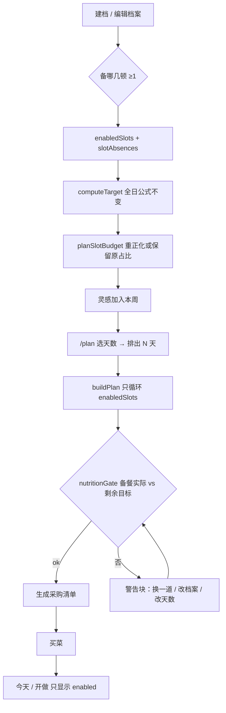
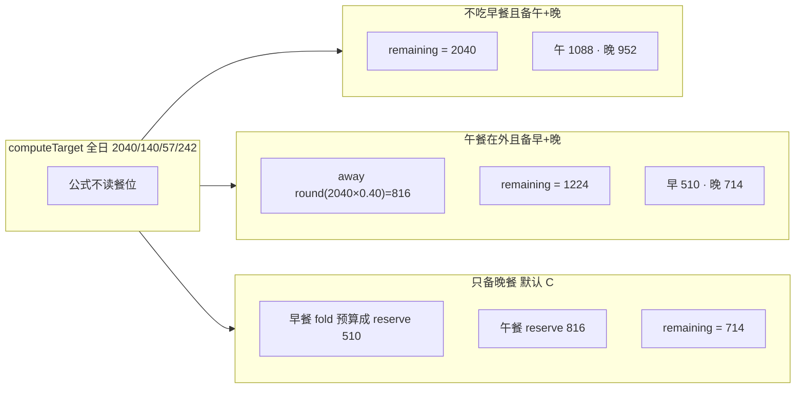

# AisleMeal 0.4 备哪几顿与餐单可信度

| 字段 | 值 |
|---|---|
| 标题 | 档案可选备餐、营养条三档色、清单硬门闩、餐单天数、底栏去柚子顶条、目录具名修剪 |
| 作者 | Grok Build（设计稿；未改仓库） |
| 日期 | 2026-08-21 |
| 状态 | **Approved（OQ1=C）** |
| 目标版本 | **0.4**（仓库 semver / `package.json`；0.3 已上线） |
| 仓库现状 | HEAD `3633b11`，`package.json` **0.3.0**，persist 键 `aislemeal:v1` **version 6**，192 食材 / **211** 菜谱（早餐-only 51、午晚餐双槽 160），祖父锁 121，原 53 `per100g` 锁 |
| 实施源 | **`docs/SPEC.md` 仍是唯一实施源**（AGENTS.md）。本文是给 SPEC 的设计输入，不是第二份规格。PR0 先改 SPEC，再写功能码。 |
| 视觉 | 继续 **Leaf & Yuzu** 世界（Q8 冻结 2026-08-20），只做 Operate **refinement**。不跑 impeccable concept-seed，本设计轮 **不** 创建 `PRODUCT.md`。 |

**已冻结、编码勿再问：** 画风（安静货架 Operate / cute-lite）、菜谱不加量、清单去掉「仍要生成」、底栏去掉柚子顶条、目录只具名修剪、营养条三档离散色、**单槽不 fold**、**剩余宏量按热量比例切全日目标**、**OQ1=C**（每顿可选不吃/在外；默认早餐不吃、午餐在外、晚餐不吃）。工程师侧 KD（单槽 fold→reserve、比例宏量）已拍板，不要再问。

---

## Overview

0.3 把主路径改成了「先选菜 → 单店静态目录过滤（已作废） → 排出 → 热量+蛋白 90–110% → 具名清单」，但档案仍默认每天早午晚三顿，`buildPlan` 写死循环 `MEAL_SLOTS`。老大 2026-08-21 的真实场景是：有人不吃早餐；有人单位吃午饭、只备晚餐。跳过的那顿热量不能默认让用户手填。

0.4 在 **不改全日公式、不改 T1/T2/T3、不改 persist 键名、不开后端** 的前提下做七件可独立合并的事：

1. 档案三勾选「备早餐 / 备午餐 / 备晚餐」；未备餐位区分 **不吃（fold）** 与 **在外面吃（reserve）**。
2. 营养条从 D-025 的绿/橙二值改为 ok / warn / danger 三档（**只改显示**；门闩仍只看热量+蛋白 90–110%）。
3. 餐单页露出天数；生成清单 **硬门闩**，删除「仍要生成清单」。
4. 底栏选中去掉柚子顶条，改品牌浅底 pill。
5. 菜谱库 211 已在 0.3 目标 [200, 250] 内，**加 0 道**；只删 1 道祖父甜品杯。
6. 单店目录删 **16** 条非烹饪/烘焙/零食 SKU（具名冻结），不动 ~44 条未引用的真实调味/原料。
7. persist **6 → 7** 写入餐位字段；cookProgress 若做改 **v8**。

保持：四栏 IA、开做非 Tab、厨具 AND、`REPEAT_BAND=0.35`、53 条 `per100g`、fail-close 11 原名、无账号无价格无美团抓取。

---

## Background & Motivation

### 当前闭环（代码事实，HEAD `3633b11`）

```
建档 /onboarding（SLOT_PCT 只展示 25/40/35，不可改）
  → 灵感加入本周 wantedRecipeIds
  → /plan 排出 store.days（默认 3；天数选择只在 /basket）
  → nutritionGate：每天 kcal+protein ∈ [90%, 110%]
  → 主按钮禁用且把 gate.reasons 写进按钮文案 + 次要「仍要生成清单」
  → 具名清单 /shopping
  → /cook?day=&slot=
```

| 点 | 现状 | 文件 |
|---|---|---|
| 档案 | `UserProfile` 无餐位开关 | `src/domain/types.ts` 61–74 |
| 全日公式 | Mifflin-St Jeor × 活动 × 目标；T1=2040/140/57/242 | `src/domain/nutrition.ts` `computeTarget`；`nutrition.test.ts` |
| 餐位热量 | `SLOT_KCAL_RATIO` 早 0.25 / 午 0.40 / 晚 0.35 | `nutrition.ts` 35–39 |
| 排餐循环 | `for (const slot of MEAL_SLOTS)`，空池 → `no_recipes_for_slot` | `src/domain/planner.ts` `buildPlan` 189–200 |
| `slotTargets` | `target.X * SLOT_KCAL_RATIO[slot]` | `nutrition.ts` 199–207 |
| 门闩 | 只 kcal+protein；脂肪 66% 仍 `ok` | `src/domain/nutritionGate.ts`；`nutritionGate.test.ts` |
| 营养条 | `barTone` → `"green" \| "amber"`，包装 `inTargetBand` | `src/components/MacroBars.tsx` |
| 餐单 CTA | 「排出 N 天」不管营养；生成主按钮 `disabled={!gate.ok}`，文案=`gate.reasons`；次要「仍要生成清单」 | `src/app/plan/page.tsx` 289–436 |
| 天数 | `DAY_OPTIONS = [1..7]` 只在 `/basket`；`setDays` 会 `stalePlanReset` | `src/app/basket/page.tsx` 41、276–279；`useAppStore.ts` 306–317 |
| 底栏选中 | `surface-2` 填充 + `2px var(--color-accent)`（`#e2a01b` 柚子）顶边 | `src/components/BottomNav.tsx` 67–74 |
| 持久化 | 键 `aislemeal:v1`，`version: 6` | `useAppStore.ts` 632–633 |
| 0.3 预留 | cookProgress 用 v7 | `docs/design-0.3.md` KD10；`persistMigrate.test.ts` 丢掉 cookProgress |
| 数据 | 192 食材 / 211 菜；祖父 121；catalog 181；未引用 65（非原 53 的 60） | `data/` + `src/generated/` + lock JSON |
| 减脂标签 | `tags` 含「减脂」仅 3 道 | `purple-potato-chicken`、`mozzarella-chicken-salad`、`raisin-oat-chicken` |
| 残留 Tailwind | onboarding / MacroBars / shopping 仍 `emerald-*` `stone-*` `amber-*` | 与 `globals.css` Leaf 代币两套皮 |

### 痛点（老大当面）

1. **档案不能说「我不备早餐」。** 求解器仍要填三格；空池就判不可行。单位午饭 / 不吃早餐是常规，不是边缘。
2. **脂肪/碳水条总橙，看起来像没达标。** 根因仍是 D-025 / NEXT-PLAN §2：鸡胸餐单脂肪常 ~66%、碳水常 ~125%，求解器脂肪碳水权重 0.5，微调只补蛋白/热量。颜色二值把「参考项偏了」画成和门闩失败同一档警告。
3. **「排出 5 天」像点不了。** 天数藏在「改本周货架」；营养失败时主按钮被 `gate.reasons` 替换成长句并变灰，用户把那颗灰按钮当成排出。次要「仍要生成清单」能绕过门闩，老大判定不合理。
4. **底栏柚子顶条丑、和叶绿世界打架。** 推翻 0.3 KD8。
5. **目录里有少数不是做饭的东西。** 不是「把 60 条未引用全删」——八角、大葱、老抽、猪蹄仍是烹饪 SKU。
6. **菜够不够、健不健康。** 211 已在 [200, 250]；库是家常菜，不是临床减脂集。不加量。

### 明确不在 0.4

美团/外卖抓取、登录、购物车、价格、账号、后端、改 53 条 `per100g`、改 fail-close 11 **原名**、改 `.agent/handoff`、改 persist **键名**、第五栏、桌面双栏、`REPEAT_BAND`、厨具改 OR、名实不符润色、SW、为变绿去改打分权重或微调补脂肪。

---

## Goals & Non-Goals

### Goals

- 档案可选备哪几顿（至少一顿）；today / plan / cook / shopping / onboarding 每餐 kcal 跟随。只备一顿时剩余目标 = 该槽 **原占比**（T1 晚餐 ≈ 714），不把另外两顿并进一盘。
- 全日公式仍只由身高体重活动目标计算；三槽全开时 T1/T2/T3 与 `HEAD_EASY_7D_MEAL_IDS` **逐位不变**。
- 营养条三档色 + 脂肪/碳水「参考」文案；门闩函数与 `TARGET_BAND` 不动。
- `/plan` 露出天数；排出 ≠ 生成清单；生成硬门闩。
- 底栏选中可读、不靠柚子细线、不只靠颜色（保留 `aria-current`）。
- 目录具名删 16 条非烹饪 SKU + 1 道蛋挞皮酸奶杯；菜谱数仍 ∈ [200, 250]。
- persist v7 可迁移；旧档案 = 三餐全备。
- 每条 PR：`npm test && npm run lint && npx tsc --noEmit`。

### Non-Goals

- 用户手填「跳过那顿」作为默认方案（OQ1 方案 D 已否决，不实施）。
- 脂肪/碳水进 `nutritionGate`。
- 把脂肪/碳水条刷成全绿。
- 批量加菜、批量删未引用调味。
- 新视觉世界、Google Fonts、新 npm UI 库、插画包。
- cookProgress（字段预留到 v8，本版不实现）。

---

## Key Decisions

1. **跳过餐政策 C：每个未备餐位选「不吃」或「在外面吃」。** 老大已选 C（2026-08-21）。不默认让用户填 kcal。默认值：取消早餐 → 不吃；取消午餐 → 在外面吃；取消晚餐 → 不吃。不吃的那顿并进剩下的备餐（**至少还备两顿时**）；单槽 fold→reserve 仍按 KD3，不要再问。
2. **Fold 只在 enabledSlots.length ≥ 2 时重正化。** 不吃 = 备的餐追求 **100% 全日公式**。原占比在 **两顿及以上** enabled 槽上重正化。例：不吃早餐、仍备午+晚 → 午 0.40/0.75、晚 0.35/0.75，remaining = 全日 2040（T1）。**禁止**把两顿 skip 并进一盘。  
   PR1 必须有 catalog 门闩夹具（不写死 recipeId）：T1、`enabledSlots=['lunch','dinner']`、早餐存储 fold、`createMealPlan` 1 天、universe=`catalogIds` → `feasible && nutritionGate.ok`。HEAD easy 对槽目标 1088/74.7 与 952/65.3 的 rank-1 都是 `box-chicken-egg-broccoli-69`（838.41 / 57.5）；两盘 ≈ **1676.8 kcal / 115 g**。catalog 微调（banana/nuts/bread/tuna，无 whey）`applyMicroAdjust` 贪心在 HEAD 上是 **tuna 然后 bread 然后 bread ≈ 1933 kcal / 137 g（94.8% / 98%）**，仍在 90–110%。测试 **只断言 `gate.ok`**，禁止快照微调件顺序或克数。**不要**用两份 `microwave-chicken-broccoli-box`（2×779）当这个夹具。若落地测试红：修打分 / 微调 / universe，**禁止**把「仍要生成」请回来。
3. **单槽（enabledSlots.length === 1）：未备槽预算一律 reserve，即使 Chip 仍显示「不吃」。** remaining = 那一顿的 **原** `SLOT_KCAL_RATIO` 份额。T1 只备晚餐 → remaining ≈ `round(2040×0.35)=714`（默认 C：早餐 fold **预算成** reserve 510 + 午餐 reserve 816）。文案：`只备一顿时，不吃的那几顿不会并进这一顿——一顿家常菜到不了全天热量。` 不恢复「仍要生成」；不把菜谱 kcal 上限从 900 抬上去；不把 remaining 静默夹到 900。  
   **单槽 awayKcal 缺省或 0 → 当作 `round(full.kcal * SLOT_KCAL_RATIO[slot])`，禁止用 0 把 remaining 拼回 1224。** `reserve+0 ≡ fold` **仅** `enabledCount ≥ 2`。  
   门闩夹具拆两条，**不要**断言 `createMealPlan` 选出微波便当：① 手搓 1 天 plan、唯一餐 `microwave-chicken-broccoli-box`（779.44 / 49.79）对 remainingTarget 714/49 → `nutritionGate.ok`；② `createMealPlan` + catalogIds + 默认 C + 只备晚餐 → `feasible && nutritionGate.ok`，**不**断言 `recipeId`。HEAD easy 对 714/49 的 rank-1 是 `box-chicken-white-broccoli-44`（鸡胸西兰花米饭）**785.21 kcal / 48.71 g**，比值 1.0997，距 `714×1.1=785.4` 只差 **0.19 kcal**。门闩前 **禁止** `roundMacros(dailyActual)`。
4. **在外 = reserve。** 备的餐只覆盖自己原来的份额，不吞掉在外那顿。在外估计默认 `round(dailyKcal * 原占比)`，可改。门闩比较 **备餐实际** vs **remainingTarget** 的热量+蛋白 90–110%。T1 午餐在外、仍备早+晚：away 816，remaining **1224**，早 510、晚 714。不要把 1530（`2040×0.75`，午+晚原占比之和）当成任何 remaining——fold 早餐后 remaining 仍是 **2040**。
5. **剩余蛋白/脂肪/碳水 = 已算好的全日目标按热量比例切。** `remaining = full * (remainingKcal / full.kcal)`。不按 remaining kcal 重跑 `PROTEIN_PER_KG`、不重跑脂肪 leftover 公式、不对 remaining 再套 `KCAL_FLOOR`（1224 不得夹回 1500）。今天条的在外蛋白是 **估计**，文案标「估计」。在外/单槽 reserve 时，家常备餐不必单独凑满 2.0 g/kg。
6. **三槽全开 ≡ 0.3。** `computeTarget` 不读餐位开关；`perMeal` 仍 25/40/35。planner / 微调在内部走 `planSlotBudget(full, ctx.profile)`；页面门闩与餐单 MacroBars 走 `remainingTarget(full, budget)`（PR5 才接）。T1/T2/T3 与 `HEAD_EASY_7D_MEAL_IDS` 不变。
7. **营养条推翻 D-025 的二值，只改 UI。** `displayTone` 的 ok **当且仅当** `inTargetBand`（共用 `TARGET_BAND`）。warn / danger 是显示叠加。不连续 HSL。不把脂肪碳水刷绿。`nutritionGate` 源码与 `TARGET_BAND` 不动。
8. **生成清单硬门闩，删除「仍要生成清单」。** 推翻 0.3 KD3 后半。排出仍不被营养禁用（KD3 前半保留）。主按钮文案永不替换成 `gate.reasons`。`generateList()` 必须 `if (!gate.ok) return`。
9. **天数选择出现在 `/plan`「排出 N 天」正上方。** 单一数据源仍 `store.days`。改天数仍 confirm 后清空餐单。`/basket` 的天数选择保留。
10. **底栏推翻 0.3 KD8。** 选中 = `surface-2`（或 brand-soft）填充 + semibold + brand 字/描边图标；**无柚子顶条**。`--color-accent` **代币保留**（`RecipeCard` / `PlanStyleSelector` 仍用），**Tab 铬不用**。四栏、`aria-current`、开做非 Tab 不动。
11. **菜谱加 0 道。** 211 ∈ [200, 250]。池大小（晚餐 160）够铺满天数；**能量**靠 KD3 单槽 remaining=原占比，不靠加菜或抬 kcal 上限。库是家常菜不是临床减脂集（`减脂` 标签仅 3）。
12. **目录具名修剪 16 条 + 删 `egg-tart-yogurt`。** 不按「未引用」批量删。原 53 条永不删。祖父锁机制保留，**唯一例外** lock 121→120 去掉 `egg-tart-yogurt`。0.4 允许丢掉这 16 条对应的 capture `ingredientHint`（D-034）；不准顺手清未引用调味。
13. **persist 6→7 承载餐位字段；cookProgress 改 v8。** 键名仍 `aislemeal:v1`。空 `enabledSlots` coerce 成三餐全备。任一 meal 因未知 recipeId 被丢掉 → **整份 `plan = null`**。清单 `items` 与 `basketIds` 用 `KNOWN_INGREDIENT_IDS` 过滤。
14. **画风：安静货架 Operate，cute-lite，不是新身份。** 签名变化只有一处：底栏选中从柚子细线改成叶绿浅底 pill。系统中文字体保持 PingFang SC 栈。不引入 design-taste-frontend。
15. **仓库版本号只在最后一条 PR 改成 0.4.0**（同 0.3 PR11）。`plan/page.tsx` 的 PR 顺序强制 **PR3 → PR4 → PR5**，禁止并行合入。

---

## Proposed Design

### 信息架构

不改 `BottomNav` 的 `TABS` href/label。不改今天主 CTA 状态机，只把「去做早餐」改成「去做{第一个 enabled 槽}」。

| 面 | 0.4 相对 0.3 |
|---|---|
| `/onboarding` | 第 5 步（估算结果）增加「备哪几顿」；`?edit=1` 同一套。向导仍 5 步，不新开第 6 步。 |
| `/` 今天 | 只列出 enabled 槽；MacroBars = 备餐实际 + 在外估计 vs **全日**目标。 |
| `/plan` | 天数选择 + 只渲染 enabled 槽 + 硬门闩警告块。MacroBars vs **备餐剩余目标**。 |
| `/cook` | 已是「没 meal 则不渲染」；排出后 plan.meals 不含 disabled 槽，自然隐藏。`?slot=` 指向 disabled 时不滚动、不 404。 |
| `/shopping` | 清单仍来自 plan.meals（不含在外）。删「营养未按目标，仅按当前餐单买菜」banner（硬门闩后不可达）。「去做」href 用第一个 enabled 槽。 |
| `/basket` | 天数选择保留；`computeBasketFeedback` 对 **disabled** 槽空池不判不可行。 |
| `/recipes` | 不加第 5 Tab、不大推荐卡。 |

### 用户旅程



### A. 跳过餐热量（方案 C）

#### 两个不能折叠的用户任务

同一套公式（T1 `full.kcal=2040`；`round(2040×r)` → 早 510 / 午 816 / 晚 714）：

| 档案 | 政策 | remaining.kcal | 槽热量（T1） |
|---|---|---|---|
| 不吃早餐，仍备午+晚 | fold（≥2 槽） | **2040** | 午 1088、晚 952 |
| 午餐在外，仍备早+晚 | reserve | **1224**（2040−816） | 早 510、晚 714 |
| 只备晚餐（默认 C） | 单槽：早餐 fold **预算成** reserve + 午餐 reserve | **714**（2040−510−816） | 晚 714 |

「1530」= `2040×0.75`，只出现在「不吃早餐且午+晚仍 enabled」的 **enabled 原占比之和**；fold 后 remaining 仍是 **2040**，不是 1530。午餐 reserve 的 remaining 是 **1224**，不是 1530。

**禁止**把两者收成「请填写那顿的 kcal」（认知负担高，单位餐很难估）。kcal 数字框 **只在「在外面吃」时出现**，默认 `round(dailyKcal * SLOT_KCAL_RATIO[slot])`。

#### 数据放在 `UserProfile`（不是另开 store 字段）

餐位是生活方式，和忌口/厨具一起走 `setProfile`。persist v7 只是 profile 形状变了，不新增 `PERSIST_FIELD_KEYS`。

```ts
export type SlotAbsencePolicy = "fold" | "reserve";

export interface SlotAbsence {
  policy: SlotAbsencePolicy;
  /** 仅 policy=reserve；缺省 = round(dailyKcal * SLOT_KCAL_RATIO[slot]) */
  awayKcal?: number;
}

export interface UserProfile {
  // …现有字段不变…
  /** 缺省或空 = 三餐全备（0.3 行为） */
  enabledSlots?: MealSlot[];
  /** 只允许出现未备的槽；备上的槽必须删掉 */
  slotAbsences?: Partial<Record<MealSlot, SlotAbsence>>;
}
```

JSON 例（只备晚餐；Chip 早餐「不吃」仍可写成 fold，**预算时当成 reserve**）：

```json
{
  "enabledSlots": ["dinner"],
  "slotAbsences": {
    "breakfast": { "policy": "fold" },
    "lunch": { "policy": "reserve" }
  }
}
```

`planSlotBudget` 对此算出 away 510+816=1326，remaining **714**。不要在 persist 里改写 fold 字段：用户以后再勾上午餐，早餐 fold 必须恢复为并入午+晚。

#### 默认与校验

```ts
export const DEFAULT_ABSENCE_POLICY: Record<MealSlot, SlotAbsencePolicy> = {
  breakfast: "fold",
  lunch: "reserve",
  dinner: "fold",
};

export function enabledSlotsOf(profile: UserProfile): MealSlot[] {
  const raw = profile.enabledSlots ?? [];
  const picked = MEAL_SLOTS.filter((slot) => raw.includes(slot));
  return picked.length > 0 ? picked : [...MEAL_SLOTS];
}

export function firstEnabledSlot(profile: UserProfile): MealSlot {
  return enabledSlotsOf(profile)[0];
}

/** Chip 文案用存储值；预算用这个。单槽时 fold 也当 reserve。 */
export function effectiveAbsencePolicy(
  profile: UserProfile,
  slot: MealSlot,
): SlotAbsencePolicy {
  const stored =
    profile.slotAbsences?.[slot]?.policy ?? DEFAULT_ABSENCE_POLICY[slot];
  if (enabledSlotsOf(profile).length === 1) return "reserve";
  return stored;
}
```

`coerceProfile`（`persistMigrate.ts`）：

- `enabledSlots`：过滤非法值、去重、保持 `MEAL_SLOTS` 顺序；空 → `["breakfast","lunch","dinner"]`。
- `slotAbsences`：丢掉 enabled 槽的键；`policy` 只认 `fold|reserve`。
- `awayKcal` 仅 reserve：先收成整数；`coerceProfile` 在其它字段齐后 `computeTarget(profile).kcal` 得到 `fullKcal`。
  - **`enabledCount ≥ 2`：** 夹到 `0..fullKcal`。`awayKcal=0` ≡ fold（remaining/full=1，ratios 在 enabled 上重正化）。
  - **`enabledCount === 1`：** `awayKcal` **缺省或 0** 都当成 `round(fullKcal * SLOT_KCAL_RATIO[slot])`，再夹到 `1..fullKcal`。禁止用 0 把早餐份额并进晚餐、拼出 remaining 1224。
  - 档案未齐无法算目标时退回 0..9999，`planSlotBudget` 按上面两条再夹一次。
- UI 单槽「在外」数字框：`min` = 该槽默认 `round(full.kcal * 原占比)`（不是 0）；提交时若为 0 / 空，当缺省处理。不要只靠文案劝人别填 0。
- 未备槽缺 absence 时 **不在 coerce 里猜默认**；UI 取消勾选时写入 `DEFAULT_ABSENCE_POLICY`。读取时若缺，`slotAbsencesOf` 用该默认。单槽 **不**把存储的 fold 改写成 reserve。

非法：零个 enabled → 三餐全备（fail-open 到 0.3）。

#### 热量数学（必须单测）

`computeTarget(profile)` **禁止**读 `enabledSlots`。T1/T2/T3 仍 2040/1390/2110 那组字段。`NutritionTarget.perMeal` 仍按原占比（onboarding 不再直接展示它）。

新函数放 `nutrition.ts`：

```ts
export interface SlotPlanBudget {
  enabledSlots: MealSlot[];
  /** disabled 为 0；enabled 之和 = remaining.kcal / full.kcal（≥2 槽 fold 时 ≈ 1） */
  ratios: Record<MealSlot, number>;
  remaining: Macros; // 备餐日目标（门闩、微调、planner 打分）
  away: Macros;      // 在外估计之和（今天条用；蛋白/脂肪/碳水是估计）
}

export function planSlotBudget(
  full: NutritionTarget,
  profile: UserProfile,
): SlotPlanBudget;

/** 给 nutritionGate / 餐单 MacroBars。kcal/protein/fat/carb = budget.remaining。
 *  perMeal[s] = full.kcal * budget.ratios[s]（禁止调用方再用 slotTargets(full)）。
 *  其它字段抄 full（tdee 等）。不对 remaining 再套 KCAL_FLOOR。 */
export function remainingTarget(
  full: NutritionTarget,
  budget: SlotPlanBudget,
): NutritionTarget;
```

算法（`effectiveAbsencePolicy`，不是存储的 Chip 字面）：

```
enabled = enabledSlotsOf(profile)
enabledSum = Σ SLOT_KCAL_RATIO[s] for s in enabled   // ≥ 1，> 0
for s in MEAL_SLOTS \ enabled:
  policy = effectiveAbsencePolicy(profile, s)        // 单槽 → 一律 reserve
  defaultAway = round(full.kcal * SLOT_KCAL_RATIO[s])
  if policy === "reserve":
    raw = absence.awayKcal
    if enabled.length === 1 && (raw == null || raw === 0):
      awayKcal[s] = defaultAway                      // 禁止 0 拼回 1224
    else:
      awayKcal[s] = clamp(raw ?? defaultAway, 0, full.kcal)
  else:
    awayKcal[s] = 0                                  // fold，仅 enabledCount≥2
awayKcalTotal = Σ awayKcal[s]
remainingKcal = max(0, full.kcal - awayKcalTotal)
scale = full.kcal > 0 ? remainingKcal / full.kcal : 0
remaining = {
  kcal: remainingKcal,
  protein: full.protein * scale,   // 不重跑 g/kg
  fat: full.fat * scale,           // 不重跑 leftover
  carb: full.carb * scale,
}
for s in enabled:
  ratios[s] = SLOT_KCAL_RATIO[s] / enabledSum * scale
for s not in enabled:
  ratios[s] = 0
away macros = full − remaining     // 今天条用；蛋白标「估计」
```

数值锁死（T1 2040/140/57/242，全部用 `round(full.kcal * r)` 当默认 away）：

| 档案 | remaining.kcal | remaining.protein | 槽 ratios × 2040 |
|---|---|---|---|
| 三槽全开 | 2040 | 140 | 510 / 816 / 714 |
| 不吃早餐、备午+晚 | 2040 | 140 | 0 / 1088 / 952 |
| 午餐在外、备早+晚 | **1224** | 140×1224/2040≈**84** | 510 / 0 / 714 |
| 只备晚餐（默认 C，早餐 fold→reserve） | **714** | 140×714/2040=**49** | 0 / 0 / 714 |

`slotTargets(target, slot)` 保持现签名、仍用 `SLOT_KCAL_RATIO`（给旧测试和「原占比」）。planner **禁止**对全日 target 调它来打分。改用：

```ts
export function slotTargetsFromBudget(
  budget: SlotPlanBudget,
  full: NutritionTarget,
  slot: MealSlot,
): Macros {
  const r = budget.ratios[slot];
  return {
    kcal: full.kcal * r,
    protein: full.protein * r,
    fat: full.fat * r,
    carb: full.carb * r,
  };
}

function safeDivisor(n: number): number {
  return n < 1 ? 1 : n;
}
```

`scoreRecipe` 改为吃 `slotTarget: Macros`（不再内部 `slotTargets(full, slot)`）。kcal / protein / fat / carb **四个分母**都走 `safeDivisor`。`planner.test.ts` 里直接调用处改传 `slotTargets(full, slot)`（三槽 ≡ 旧值）。



**禁止的混合例：** 早餐不吃 + 午餐在外 + **只备晚餐** 不得把早餐 510 并进晚餐（那会 remaining=1224，HEAD 晚餐最高 838、catalog 微调无 whey，过不了硬门闩）。单槽规则把它收成 remaining=714。

#### 门闩与微调

- `nutritionGate(plan, target)` **源码不动**（PR1 不改这个文件）。调用方传入 `remainingTarget(full, budget)`。`TARGET_BAND` 不动。脂肪碳水仍不进门闩。
- `applyMicroAdjust` 瞄准 `remainingTarget` 的 95% / 105% 帽，**禁止**再拿全日 2040 去补在外缺口。`setProfile({ recomputeMicro })` 继续传 `computeTarget(next)`；`recomputeMicroAdjust` **内部**用 `ctx.profile` 算 budget，不必新 store API。
- 在外热量填到剩余 < 200 kcal 或蛋白 < 10 g（**仅 enabledCount≥2 且用户真填了很大的 away**）：planner 仍可排出，gate 失败，警告块加「在外热量填得太高，备餐目标过低」。不要把 remaining 夹到 900。单槽 away=0 不当用户真填，按默认份额重填。
- 页面接线：餐单 MacroBars + `nutritionGate(feasible, remainingTarget(...))` + `generateList` 守卫 **PR5**。今天条 **PR3**：备餐实际 + 在外估计 vs **全日**（在外蛋白 caption「估计」）。

#### UI 文案（onboarding 第 5 步，编辑档案相同）

放在「这是估算目标，不是处方」**之上**，因为每餐 kcal 依赖它。

- 标题：`这几天你备哪几顿`
- 说明：`至少选一顿。单位午饭或早餐不吃，都可以。`
- 三枚 Chip：`备早餐` / `备午餐` / `备晚餐`。选中 = 已有 Chip 视觉（brand 底白字，`src/app/onboarding/page.tsx` 69–90）。取消最后一枚：no-op，`aria-disabled`。
- 每个 **未勾选** 槽：`role="radiogroup"` 两选项 `不吃` | `在外面吃`。单槽时控件可仍选「不吃」，预算当 reserve。
- 辅助一句（≥2 槽）：`不吃：其他备的餐会吃满一天目标。在外：备的餐只覆盖自己那一顿。`
- **只备一顿时**追加：`只备一顿时，不吃的那几顿不会并进这一顿——一顿家常菜到不了全天热量。`
- `在外面吃` 才显示数字框：label `在外大约多少 kcal`，placeholder/默认 = `round(dailyKcal * 原占比)`，`inputMode="numeric"`，`max={target.kcal}`。`enabledCount ≥ 2` 时 `min=0`；**只备一顿时 `min` = 该槽默认 away**（T1 早餐 510 / 午餐 816 / 晚餐 714），提交 0 或空按缺省重填。
- 全日四格数字仍展示 `computeTarget` 的 kcal/protein/fat/carb（T1 那组）。
- 每餐列表用 **budget**（单槽 fold 行按 reserve 写）：
  - enabled：`{槽名} 约 {round(full.kcal * ratios[s])} kcal`
  - fold 且 ≥2 槽：`{槽名}不吃，热量已并入其他备的餐`
  - reserve 或单槽未备：`{槽名}在外约 {awayKcal} kcal，不并入备餐`
- **禁止**再展示写死的 `SLOT_PCT` 25/40/35 在未备槽上。`onboarding/page.tsx` 的本地 `SLOTS` / `SLOT_PCT` 删掉百分比常量，循环 `MEAL_SLOTS` + `planSlotBudget`。
- 百分比可写 `约 {Math.round(ratios[s]*100)}%`，仅 enabled。

`draft` useMemo **必须**带上 `enabledSlots` / `slotAbsences`，否则 `coerceProfile` 会丢掉。`constraintsChanged` 把这两项和厨具/忌口放一起（confirm 清空餐单）。**禁止**把餐位改动放进 `bodyOrGoalChanged`（那会 `recomputeMicro` 旧三槽 plan）。餐位变更只 `resetPlan`，永不 `recomputeMicro`。

#### 调用点清单（PR1 领域 / PR3 UI）

所有 `for (const slot of MEAL_SLOTS)` 能跟档案走的，改 `enabledSlotsOf(profile)`，不要再复制一份本地列表。

| 位置 | PR | 行为 |
|---|---|---|
| `planner.ts` `buildPlan` ~L190 | 1 | 只循环 enabled；disabled 空池不是 infeasible |
| `planner.ts` `scoreRecipe` / `pickRecipeId` / `pickWantedRecipeId` / `alternativesFor` / `replaceMeal` / `applyMicroAdjust` / `recomputeMicroAdjust` | 1 | 函数开头 `planSlotBudget(full, ctx.profile)`；打分 `slotTargetsFromBudget`；微调瞄 remaining |
| `recommend.ts` ~236 / 251 / 398 | 1 | 一键篮只循环 enabled；只备晚餐不因早餐池空失败 |
| `basketFeedback.ts` `emptyEquipmentSlots` ~L46 | 1 | 只检查 enabled。`bySlot` 仍可数三槽（页面没用它做可行性） |
| `nutritionGate.ts` | **不改源码** | 测试用 `remainingTarget(...)` 包一层 |
| `onboarding/page.tsx` `SLOTS`/`SLOT_PCT`/`draft`/`constraintsChanged` | 3 | 见上 |
| `plan/page.tsx` `DayBlock` ~L521 | 3 | 只 map enabled。**本 PR 不改** MacroBars / gate / CTA |
| `page.tsx` ~L117 `nextSlot: "breakfast"`、~L121 `MEAL_SLOTS.map` | 3 | `firstEnabledSlot`；只列出 enabled；今天条 = 备餐+在外 vs 全日 |
| `shopping/page.tsx` `cookHref` `slot=breakfast` ~L115 | 3 | `firstEnabledSlot` |
| `cook/page.tsx` ~L118 | 已 skip 无 meal | 不 404；disabled `?slot=` scroll 空操作 |
| `BasketOutcomeSummary.tsx` / `basket/page.tsx` coverage | 3 | 早餐 disabled 时不要写「N 种早餐」。改成按 enabled 槽拼接，或隐藏早餐句 |
| `RecommendationPreview.tsx` 「早餐 n · 正餐 m」 | 3 | 早餐未备则不提早餐计数 |
| wanted chips 「未排上」 | 3 | 早餐菜在早餐未备时显示「这顿不备」而不是像排失败 |
| `plan/page.tsx` MacroBars / `nutritionGate(feasible, remainingTarget)` / `generateList` 守卫 | **5** | 见 E |
| 购物清单 `buildShoppingList` | — | meals 已不含未备槽，无需新参数 |

今天 MacroBars：

```
displayActual = addMacros(plan.dailyActual[day], budget.away)
displayTarget = full  // computeTarget
caption: 有 away 时「含在外估计 {round(away.kcal)} kcal · 蛋白脂肪碳水均为估计」
```

餐单 MacroBars（**PR5**，不是 PR3）：

```
actual = plan.dailyActual[day]   // 只有备餐
target = remainingTarget(full, budget)   // 不是 computeTarget 全日
caption 前缀：有 away 时「对照备餐目标（已扣除在外估计）」
```

两页对比对象不同，必须在文案里写清，避免「今天绿、餐单橙」。PR3 落地后、PR5 之前：餐单条仍可能拿全日比一顿晚餐——已知窗口，PR5 关闭。

### B. 营养条三档色

`inTargetBand` / `TARGET_BAND` / `nutritionGate` **不动**。新函数放 `nutrition.ts`（领域可测、MacroBars 不进 domain）：

```ts
export type DisplayTone = "ok" | "warn" | "danger";

export function displayTone(actual: number, target: number): DisplayTone {
  if (inTargetBand(actual, target)) return "ok"; // 与 TARGET_BAND / 门闩同一闭区间
  const ratio = actual / (target || 1);
  if (ratio >= 0.75 && ratio <= 1.25) return "warn";
  return "danger";
}
```

禁止在 `displayTone` 再写死 0.9/1.1。`nutritionGate` / `TARGET_BAND` 不动。

`MacroBars.barTone` 改为调用它，返回 `"ok" | "warn" | "danger"`（打破 `"green" | "amber"`）。

| 实际/目标 | tone | 文案（禁止「不健康」） |
|---|---|---|
| 90–110% | ok，`--color-ok` | `{宏量}在目标范围内` |
| 75–90% 或 110–125% | warn，`--color-warn` | `{宏量}偏低（勉强）` / `{宏量}偏高（勉强）` |
| 其它 | danger，`--color-danger` | `{宏量}明显偏低` / `{宏量}明显偏高` |

脂肪、碳水标签：`脂肪（参考）` `碳水（参考）`。caption 同样加「参考」。理由：它们不进门闩；橙/红表示偏离目标，不是有毒。

条轨背景用 `--color-surface-2`，不要 `stone-100`。条宽可 `transition: width 180ms`（已有 `prefers-reduced-motion` 全局清零）。

**不要**为了好看把 66% 脂肪画成 ok。鸡胸餐单脂肪 ~66% → **danger**（<75%）；碳水 125% → **warn** 偏高（勉强）。这是数据，不是条卡死。换一道若把脂肪拉到 80%，应变 warn，证明条会动。

`src/app/plan/page.tsx` 370–391 的 caption **PR4 必须整段改写**：现在 `tone === "green"` / `ratio < 0.9` 会让 warn 与 danger 都叫「偏低」。改走 `displayTone` + 上表（勉强 vs 明显）。今天页 MacroBars 共用组件。

测试（`nutrition.test.ts`）：

- `inTargetBand` 为真 ↔ `displayTone === "ok"`（含 0.90 / 1.10）
- 0.899 / 1.101 → warn
- 0.75 / 1.25 → warn
- 0.749 / 1.251 → danger
- 42/64 ≈ 0.656 → danger（验收那组脂肪）
- 239/191 ≈ 1.251 → danger

### C. 菜谱量

核实：211 菜，早餐-only 51，午晚餐双槽 160，无其它槽型。`data.test.ts` 要求 [200, 250]、早餐 ≥40、午/晚各 ≥80、每道 kcal ∈ [200, 900]。HEAD 实际最高 `box-chicken-egg-broccoli-69` ≈ **838.41** kcal。只备晚餐时池=160 够铺天数（D-023），**不够吃满 2040 或误拼的 1224**——靠 KD3 把单槽 remaining 收成原占比 714。catalog 微调无 fail-close whey（banana / mixed-nuts / bread / tuna）。

对 T1 remaining 714/49，catalog easy rank-1 是 `box-chicken-white-broccoli-44` **785.21 / 48.71**（距 `714×1.1` 仅 0.19 kcal）；`microwave-chicken-broccoli-box` 是 779.44 / 49.79，**门闩可过但不是 createMealPlan 首选**。不吃早餐、备午+晚（remaining 2040）easy 两槽 rank-1 都是 `box-chicken-egg-broccoli-69`；两盘+微调可进门闩，见 KD2 测试。**禁止**断言 `createMealPlan` 选出微波便当；**禁止**「只备晚餐 + fold 两顿 skip → remaining=2040 且 gate ok」。

健康：日常家常菜，不是减脂处方。`减脂` 标签 3 道；烤肠/午餐肉/馄饨/馒头/手抓饼是正餐，保留。

**加 0 道。** 0.3 目标已满足。不为「看起来更健康」加酸奶杯或沙拉。

可选修剪非祖父甜品杯：**不做**。`mango-yogurt-cup` 等水果酸奶杯都在 121 lock 里，且依赖 fail-close `greek-yogurt`，catalog 模式本来就做不了。只删 D 点名的 `egg-tart-yogurt`。

删完后 210 道，仍 ∈ [200, 250]；早餐 50 ≥ 40。

### D. 目录具名修剪（冻结名单）

用户要的是「极少数不对劲」，不是清未引用。未引用 65 条，其中非原 53 的 60 条多数是八角/大葱/老抽/淀粉/猪蹄——**留**。

**永不删** `src/domain/ingredientPer100g.lock.json` 的 53 个 id（即使未引用）：核实未引用原 53 = `edamame`、`chinese-yam`、`bean-sprout`、`avocado`、`mixed-nuts`（后者仍是 `MICRO_ADJUST_PORTIONS` 15 g）。fail-close 11 行整行保留（含原名）。

**删除（16 食材 + 1 菜谱），已核对引用：**

| id | 货架名 | 类别 | catalog | 引用 |
|---|---|---|---|---|
| `cake-flour` | 展艺蛋糕用小麦粉(低筋面粉)500g | carb | 是 | 无 |
| `gelatin-sheet` | 展艺吉利丁片50g(内含10片) | seasoning | 是 | 无 |
| `instant-yeast` | 安琪高活性干酵母15g*5袋 | seasoning | 是 | 无 |
| `baking-powder` | 百钻未添加铝双效泡打粉50g | seasoning | 是 | 无 |
| `powdered-sugar` | 舒可曼糖霜250g(糖粉烘焙原料) | seasoning | 是 | 无 |
| `whipping-cream` | 稀奶油 | fat | 是 | 无 |
| `condensed-milk` | 熊猫牌调制加糖炼乳350g | protein | 是 | 无 |
| `red-bean-paste` | 展艺红豆沙(水洗)500g | carb | 是 | 无 |
| `glutinous-rice-flour` | 三象牌水磨糯米粉500g 泰国进口 | carb | 是 | 无 |
| `coconut-flakes` | 展艺原汁椰蓉100g | fat | 是 | 无 |
| `osmanthus-syrup` | 云峰糖桂花300g | seasoning | 是 | 无 |
| `hawthorn-cake` | 好想你去皮去核枣100g | carb | 是 | 无（id 名是山楂糕，货是红枣；无菜谱引用） |
| `pork-floss` | 味斯美腰果猪肉松脆60g（20-23小包） | protein | 是 | 无 |
| `milk-powder` | 维维维他型豆奶粉560g | protein | 是 | 无 |
| `wasabi-sauce` | 凤球唛青芥辣43g | seasoning | 是 | 无 |
| `egg-tart-shell` | 展艺速冻蛋挞皮20g*24个(大) | carb | 是 | `egg-tart-yogurt` **[LOCK]** |

同步删菜谱 `egg-tart-yogurt`（蛋挞皮酸奶杯，祖父 121 之一）。这是 0.4 **唯一** lock 例外：`originalRecipeIds.lock.json` 长度 121→120，只去掉这一 id。测试「祖父 lock 不可增删」改为：其余 120 个 id 仍在且 lock 不再增长/再删。

**保留（即使未引用或「不够健康」）：** oats、mixed-nuts、馄饨 `wonton`、馒头 `steamed-bun`、手抓饼 `hand-grab-pancake`、烤肠 `grilled-sausage`、午餐肉 `luncheon-meat`、猪蹄 `pig-trotter`、全部调味香料、中筋 `wheat-flour`、蜂蜜 `honey`（`SHELF_CORRECTION_IDS` 留下它）。

`SHELF_CORRECTION_IDS` 现为 `["honey", "hawthorn-cake"]`（`basketGrid.ts` 41）。删红枣后改为 `["honey"]`。`data.test.ts`「牛奶红枣蜂蜜鸡爪」拆成牛奶/蜂蜜/鸡爪，**去掉红枣断言**。

`data.test.ts` L154–158：每个非饮料 capture `ingredientHint` 必须仍有一条 `ingredient.name ∈` 该 hint 的 SKU 名。删 16 条后下列 hint **零库存**，PR6 必须用 **退休 hint 白名单** 跳过，而不是删整段覆盖测试、也不是把未引用调味一起删掉：

`低筋粉`、`糖粉`、`奶粉`、`蛋挞皮`、`粘米粉`、`红豆沙`、`椰奶`（对应 `coconut-flakes` 椰蓉）、`炼乳`、`奶油`、`活性酵母`、`桂花`、`吉利丁`、`肉松`、`红枣`、`泡打粉`、`芥末酱`。

规则：`if (SKIP_HINTS.has(hint) || RETIRED_HINTS_0_4.has(hint)) continue;` 然后「未退休 hint 仍须有货」。D-034 / `handoff decide`：0.4 可以丢掉具名非烹饪 SKU 及其 hint；不准批量删未引用调味。53 `per100g` 锁不动。

落地步骤：改 `data/ingredients.json` + `data/recipes.yaml` → `npm run build-data` → 提交 `src/generated/*`。引用完整性、53 per100g、餐位配额、kcal ∈ [200,900] 必须仍绿。

预期计数：食材 192−16=**176**；catalog 181−16=**165**；菜谱 **210**。

### E. 餐单天数 + 生成硬门闩

#### 天数

抽出共享常量，避免两页各写一份：

```ts
// src/lib/days.ts
export const DAY_OPTIONS = [1, 2, 3, 4, 5, 6, 7] as const;
```

新组件 `src/components/DaysPicker.tsx`：从 `basket/page.tsx` 339–384 抽出 radio 组（方向键、`aria-checked`、选中 brand 底）。`/plan` 放在「排出 N 天」**紧上方**，label `备几天`。`/basket` 改用同一组件，label 仍可 `买几天`。

`onChange` 由页面 confirm 后调 `setDays`。文案沿用：「将清空当前餐单」。`setDays` 已 `stalePlanReset`（清 plan、活跃清单 stale）。

单一数据源：`store.days`，默认 `DEFAULT_DAYS = 3`。

#### 排出 vs 生成（文案层级，修「排出点不了」）

餐单页固定顺序：

1. scopeMode、排餐偏好、wanted chips  
2. **DaysPicker**  
3. **排出主按钮**（brand 实心）：`排出 ${days} 天` 或 `用这几道排出 ${days} 天`  
   - disabled **仅** `wantedAllUncookable`（现逻辑）  
   - **绝不**因 `nutritionGate` 禁用  
   - 按钮下小字：`排出只做餐单，不买菜。`  
4. 天网格 / 换一道  
5. 营养估算  
6. 若 `feasible && !gate.ok`：**警告块**（不是按钮）  
7. 生成清单按钮，文案只允许：`生成采购清单` 或 `清单已过期，重新生成`  
8. 「改本周货架」保持次要文字链

警告块 copy：

```
热量或蛋白还没落在备餐目标的 90%–110%。
{gate.reasons 各一行，已是「第 2、5 天热量偏高」}
可以：换一道 · 改档案 · 改天数
脂肪和碳水是参考，不挡住生成。
```

（最后一句防止用户看到脂肪红条以为过不了门闩。）

主按钮：

```ts
disabled={gate != null && !gate.ok}
// children:
activeList ? "清单已过期，重新生成" : "生成采购清单"
```

**删除** `仍要生成清单` 整颗按钮（`plan/page.tsx` 427–436）。`generateList()` **必须**（不是可选）在入口 `if (!gate || !gate.ok) return`：今天函数体没有 gate 检查，只靠 disabled 属性挡不住其它调用。`gate` 用 `nutritionGate(feasible, remainingTarget(full, planSlotBudget(full, profile)))`。

推翻 0.3：主按钮禁用时用 `gate.reasons` 当 label；买菜 banner「营养未按目标，仅按当前餐单买菜」一并删（`shopping/page.tsx` 117–123、175–178）。旧 persist 里靠绕过生成的清单仍可看，但当前 plan 再生成必须过门闩。

### F. 底栏 + 视觉 refinement

**模式：** impeccable Operate。熟悉、一致、语义色、accent 只用于选择/动作/状态。150–250 ms。UI 标签不用 display 字体。不发明控件。

**世界：** Leaf & Yuzu 已冻结。本轮是 refinement 不是换皮肤。`--color-brand: #1f4d3a` 仍是主色。`--color-accent: #e2a01b` **代币保留**（`RecipeCard.tsx`、`PlanStyleSelector.tsx` 仍用），**底栏选中铬不用**。PR0 SPEC §8 写明这句。警告走 `--color-warn: #c45c26`，不是柚子。可选 `--color-brand-soft` **仅当** `surface-2` 对比不够。不引入 design-taste-frontend。

**签名变化（frontend-design 只许一处）：** 底栏选中从「柚子 2px 顶边」改为「叶绿浅底 pill」。

`BottomNav.tsx` 选中 `span`：

```
background: var(--color-surface-2)  // 或新增 --color-brand-soft
color: var(--color-brand)           // 已在 Link 上
font-semibold on label
Icon strokeWidth 2 vs 1.75, fill none（lucide 描边标 fill 会糊，0.3 这条保留）
borderTop: none                     // 去掉 2px accent
border-radius: 0.75rem              // 已有 rounded-xl
:active → --color-brand-press
aria-current 逻辑一字不改
inactive: --color-text-3
```

可选 token：`--color-brand-soft: color-mix(in srgb, var(--color-brand) 12%, var(--color-surface));` 若 `surface-2`（`#e7eeea`）对比不够再启用。不新增 npm 依赖、不加载 Google Fonts。

同一 PR 把残留工具色换成代币（壳只有一套皮）：

| 文件 | 现况 | 改为 |
|---|---|---|
| `MacroBars.tsx` | `stone-*` `emerald-500` `amber-400` | PR4 已换成 ok/warn/danger |
| `onboarding/page.tsx` | 大量 `stone-*`、`emerald-600` 主按钮、`amber-50` 下限提示 | 主按钮 `--color-brand`；提示 `--color-warn` + `surface-2`；边框 `--color-line` |
| `shopping/page.tsx` | `stone-800/400`、`accent-emerald-600`、`text-amber-600` | brand / text / warn 代币 |

不新插画、不第五 Tab、不改圆角体系以外的 layout、不做桌面双栏。cute-lite = Chip 口吻（「备早餐」）和浅底 pill，不是贴纸。

无障碍：选中不只靠颜色（字重 + 浅底 + `aria-current`）。对比走 brand `#1f4d3a` 在浅底上。`:focus-visible` 已有。

### G. 版本 / 文档 / 协议

- 目标仓库版本 **0.4.0** 只在最后一条 PR 改 `package.json` + README/SPEC 一句。
- persist **version 6 → 7**。`migratePlan`：`if (version < 7)` 走一遍 `coerceProfile`（写入 enabledSlots 默认三餐）。`sanitizePersisted` 每次都 coerce，所以旧 blob 不 bump 也能读；bump 是为了把 cookProgress 从「0.3 说的 v7」改到 v8，并让 `recommend.test.ts` 的 `version: 7` 扫描成立。
- cookProgress 若出现在旧脏数据里，继续靠 `sanitizePersisted` 不拷贝未知键丢掉（现测已覆盖）。**不要**在 v7 实现 cookProgress。
- PR0：改 `docs/SPEC.md` §0/§4 每餐说明 + §5.2 循环 enabledSlots + §8 餐单文案/门闩；`docs/PLAN.md` 加 0.4 注；`docs/DECISIONS.md` 追加 D-033 起。`.agent/DECISIONS.md` 用 `sh .agent/handoff decide` 在 **编码时**写，本设计轮不跑 handoff、不改仓库。
- 本文件是 SPEC 输入。冲突以落地后的 SPEC 为准。

编码时必须 `handoff decide` 的推翻 / 新条：

- D-025 视觉二值 → 三档（门闩不放宽）
- 0.3 KD3「次要仍要生成」→ 删除
- 0.3 KD8 柚子顶条 → 浅底 pill（accent 代币保留，Tab 不用）
- cookProgress 从 v7 改 v8
- D-033 备餐餐位方案 C + 单槽 fold 预算成 reserve
- D-034 0.4 可丢掉具名非烹饪 SKU 及其 capture hint；不准批量删未引用调味

---

## API / Interface Changes

无 HTTP。领域函数变更如下。

### `src/domain/types.ts`

`UserProfile` 增加可选 `enabledSlots`、`slotAbsences`（见上）。`NutritionTarget` **不改**（T1 结构稳定）。

### `src/domain/nutrition.ts`

新增：`DEFAULT_ABSENCE_POLICY`、`enabledSlotsOf`、`firstEnabledSlot`、`effectiveAbsencePolicy`、`planSlotBudget`、`remainingTarget`、`slotTargetsFromBudget`、`displayTone`。  
不改：`computeTarget`、`SLOT_KCAL_RATIO`、`TARGET_BAND`、`inTargetBand`、`bandSide`。

### `src/domain/planner.ts`

```ts
export function buildPlan(
  candidates: Recipe[],
  target: NutritionTarget, // 调用方仍传 computeTarget 全日；内部 planSlotBudget(full, ctx.profile)
  days: number,
  ctx: PlanContext,
): MealPlan | InfeasiblePlan
```

`createMealPlan` / `replaceMeal` / `alternativesFor` / `recomputeMicroAdjust` 签名不变。各自内部从 `ctx.profile` 算 budget。`scoreRecipe` 改为 `(recipe, slotTarget: Macros, day, days, byId)`，四分母 `safeDivisor`。`applyMicroAdjust` 的 0.95/1.05 对着 `remainingTarget`。

### `src/domain/nutritionGate.ts`

**PR1 不改这个文件。** 签名仍 `(plan, target)`。新测写在 `nutritionGate.test.ts` / `nutrition.test.ts`：先 `remainingTarget(...)` 再调用。午餐 reserve（仍备早+晚）remaining = **1224**（T1），不是 75% 全日；备餐实际对准 1224 → ok，对准 2040 → 热量偏高。只备晚餐 remaining=**714**。仅脂肪 66% 仍 ok（对传入的那个 target 而言）。

### `src/domain/recommend.ts` / `basketFeedback.ts`

槽循环改 enabled。只备晚餐 + 全厨具 → 一键篮仍 `ok`。

### Store

`useAppStore.ts`：`version: 7`。`setProfile` 已能 resetPlan。不新增 actions；onboarding 把字段放进 `UserProfile` 即可。`recommend.test.ts` 把 `version: 6` 断言改成 `7`。

### UI

| 组件 | PR | 变化 |
|---|---|---|
| `DaysPicker` | 5 | 新 |
| `MacroBars` | 4 | `barTone` 三档；代币色；脂肪碳水「参考」 |
| `BottomNav` | 7 | 去顶条 |
| `plan/page.tsx` | 3→4→5 **串行** | 3=DayBlock enabled；4=caption 三档；5=天数+remainingTarget 门闩+generateList 守卫 |
| `onboarding/page.tsx` | 3 功能 / 7 代币 | 3 先合 |
| `page.tsx` / `cook` / `shopping` | 3 | 隐藏 disabled；cookHref；今天条 vs 全日 |

---

## Data Model Changes

### Persist v7

键名 `aislemeal:v1` 不变。`version: 7`。

`migratePlan(state, version, …)`：

```
if (version < 6) migrateToNamedLists   // 已有
if (version < 7) {
  // profile 缺字段由 coerceProfile 填三餐全备
  // 不写 cookProgress
}
return sanitizePersisted(next)
```

`coerceProfile` 输出始终带 `enabledSlots`（至少三餐默认）和规范化后的 `slotAbsences`。

旧 v6 档案：三餐全备、无 absence → 排餐与 0.3 bit-identical。

`coerceMeals`：丢掉 `!KNOWN_RECIPE_IDS` 的行。**只要丢掉过至少一餐**（例如旧 plan 里有 `egg-tart-yogurt`），`coercePlan` 返回 **`plan = null`**（与 `migratePlan` `version < 4` 整份作废相同），**不要**留下 8 格 + 仍含甜品 kcal 的旧 `dailyActual`。不要尝试局部重算 dailyActual。

`coerceShoppingListItem` / 清单 `items`：丢掉 `!KNOWN_INGREDIENT_IDS` 的行（旧清单上的 `egg-tart-shell`）。`coercePantry` **已**丢未知 id。`wantedRecipeIds` 已按 `KNOWN_RECIPE_IDS` 过滤。`basketIds` 在 sanitize 时按 `KNOWN_INGREDIENT_IDS` 过滤。空 `enabledSlots: []` → 三餐全备。

`PERSIST_FIELD_KEYS` 不增加。`partialize` 不增加。`resetAll` 仍回到 `initialState`（profile null）。

### 数据文件

- `data/ingredients.json`：删除上表 16 个对象。**禁止**改剩下任何 `per100g`。
- `data/recipes.yaml`：删除 `egg-tart-yogurt` 整块。
- `src/domain/originalRecipeIds.lock.json`：去掉 `"egg-tart-yogurt"`，长度 120。
- `src/domain/ingredientPer100g.lock.json`：不动。
- `src/generated/*`：`npm run build-data` 重生。
- `src/domain/basketGrid.ts`：`SHELF_CORRECTION_IDS = ["honey"]`。

无后端 schema、无云迁移。回滚 = git revert。用户刷新后 `migrate` 一次。

---

## Alternatives Considered

### 1. 跳过餐政策

| 方案 | 做法 | 为何不取 |
|---|---|---|
| **C（推荐）** | 每槽不吃 / 在外；**单槽时 fold 预算成 reserve** | 两种真实任务不折叠；一盘菜吃不满全日 |
| A | 永远 fold | 单位午饭会被晚餐吞掉；只备一顿时 remaining=2040，HEAD 最高 838，硬门闩永久灰 |
| B | 永远 reserve，无第二控件 | 不吃早餐的人午餐会不够吃（只拿原 40%） |
| D | 必须手填跳过餐 kcal | 认知负担 |
| 单槽 remaining 夹到 900×n+微调 | 静默改目标 | 禁止。目标必须是原占比，不是「菜谱能到的数」 |
| 单槽 awayKcal=0 当 fold | 拼出 remaining 1224 | 禁止。仅 ≥2 槽 0≡fold；单槽 0=默认份额 |
| 单槽保留「仍要生成」 | 窄绕过 | 老大已否；KD3 用 reserve 让门闩可过 |
| 抬菜谱 kcal 上限 / 加高热量菜 | 为单槽凑 1224 | 禁止。0.4 加 0 道 |

未选「第三个模式：跳过餐按零食 10%」——无用户证据，且破坏 T1 对齐。

### 1b. 剩余蛋白怎么切

| 方案 | 为何不取 |
|---|---|
| **按热量比例切已算好的全日目标（采用）** | 单槽 714 kcal 配 49 g 蛋白，HEAD 779/50 过门闩；在外蛋白标估计 |
| remaining 仍要 140 g（g/kg） | 只备晚餐时蛋白门闩 lo=126 g，catalog 无 whey，过不了 |
| 对 remaining kcal 重跑 computeTarget / KCAL_FLOOR | 1224 会被夹回 1500，打分目标再次飘 |

### 2. 营养条颜色

| 方案 | 为何不取 |
|---|---|
| **三档离散（采用）** | 代币已有 ok/warn/danger；色盲可辅以文案；测试稳定 |
| 全绿 | 假装脂肪 66% 达标，骗信任 |
| 连续 HSL | 无代币、难测、难 a11y、和门闩二值语义打架 |
| NEXT-PLAN 脂肪碳水放宽到 70–130% 才绿 | 仍是二值；125% 碳水会绿、66% 脂肪仍橙；不如三档诚实 |
| 脂肪碳水灰色常驻 | 看不出 66% vs 95% |

### 3. 生成门闩

| 方案 | 为何不取 |
|---|---|
| **硬门闩（采用）** | 老大：不达标为什么还能生成 |
| 0.3 软门闩「仍要生成」 | 直接被判不合理 |
| 排出也禁用 | 和 KD3 前半冲突；看餐单/换一道必须先有 plan |
| 脂肪碳水也进门闩 | 鸡胸餐单系统性过不了，生成永久卡住 |

### 4. 目录修剪

| 方案 | 为何不取 |
|---|---|
| **具名 16 条（采用）** | 对上「极少数」 |
| 删全部 60 条未引用非原 53 | 八角老抽猪蹄都是真烹饪；破坏以后写菜 |
| 连原 53 未引用也删 | 锁与 AGENTS 硬约束 |
| 保留 egg-tart-shell 以免动 lock | 留下明确的非正餐 SKU，和 D 点名冲突 |

### 5. 底栏选中

| 方案 | 为何不取 |
|---|---|
| **浅底 pill + 字重 + brand 描边标（采用）** | 不靠细线、不靠单色；和 Chip/天数 radio 同一套「选中=填底」 |
| 0.3 柚子顶条 | 老大讨厌、和叶绿打架 |
| 整块 brand 实心 + 白字 | 底栏过重，四个 Tab 像四个主 CTA |
| 图标 fill | 0.3 已否：lucide 描边标 fill 糊成块 |

---

## Security & Privacy Considerations

仍无账号、无后端、无地址、无支付。用户数据只在 `localStorage` 键 `aislemeal:v1`。`resetAll` 本机清空。档案不进 URL。

威胁与缓解：

| 项 | 处理 |
|---|---|
| 原型污染 | 已有 `DANGEROUS_KEYS`；餐位字符串只认 `MEAL_SLOT_SET` |
| `awayKcal` 极大/NaN | ≥2 槽夹到 `0..full.kcal`（0≡fold）；单槽缺省或 0 → 该槽默认 round(full×占比) |
| 删食材后 persist 脏 id | pantry / 清单 items / basketIds 丢未知；未知 recipe **整份 plan=null** |
| 孤儿展示 | 0.3：`pantryUniverse` = 菜谱引用 ∪ 全部调味 ∪ **仍在 ingredients 里的**已有 id。删掉的 SKU 不是孤儿，是消失。不要做墓碑表。 |
| XSS | 仍无 markdown 渲染用户 HTML；清单名 `truncateListName` 已有 |

不做分析埋点（SPEC §0 明确不做）。

---

## Observability

无后端、无 metric、无 alert。验证 = 命令真实跑过：

```
npm test && npm run lint && npx tsc --noEmit
```

`scripts/build-data.mjs` 继续非零退出打印引用/餐位覆盖失败。stdout 仍打 inCatalog 计数（0.3 已有）。

门闩 `reasons` 给人看，不写遥测。migrate 失败不得丢掉 profile（现 sanitize 路径）。

---

## Rollout Plan

静态 PWA，无 feature flag 基础设施。用 PR 切片当旗标：PR0 只改文档，功能码从 PR1 起，版本号 PR8 才 0.4.0。

1. 用户刷新 → zustand persist `version` 6→7 → `coerceProfile` 补三餐全备。  
2. 未点「档案」的人：行为与 0.3 完全相同（含 T1 餐单）。  
3. 回滚：git revert 对应 PR；localStorage 多出来的 `enabledSlots` 会被旧 `coerceProfile` 忽略（未知键不进 `UserProfile`）。不要 version 改回 6。  
4. 删 SKU 后若用户 pantry / 清单 / 篮子里有蛋挞皮：下次加载那一行消失，不崩。餐单若含 `egg-tart-yogurt`：**整份 plan=null**，用户重新排出（不要半残 meals + 旧 dailyActual）。

---

## Risks

| 风险 | 严重度 | 缓解 |
|---|---|---|
| 重正化漏进 `computeTarget`，T1 测试红 | 高 | `computeTarget` 禁止读餐位；T1/T2/T3 原断言保留；三槽 `HEAD_EASY_7D_MEAL_IDS` 保留 |
| 空 `enabledSlots` 锁死排餐 | 高 | coerce 成三餐；UI 禁止取消最后一枚 |
| 只备一顿 fold 进 2040/1224，硬门闩永久灰 | 高 | KD3：单槽未备槽预算 reserve；awayKcal 0 当默认份额；构造夹具微波便当 + createMealPlan 只断言 gate.ok |
| 不吃早餐两槽 remaining=2040 过不了门闩 | 高 | KD2 catalog 1 天 createMealPlan + gate.ok；不写死 2×779；红了修打分/微调，不请回「仍要生成」 |
| 门闩前 roundMacros 把 785.21 打出 110% | 高 | 对 remaining 与 dailyActual 都用未取整浮点；注释 0.19 kcal 天花板 |
| 在外 kcal 把剩余目标打到地板 | 中 | 夹 0..full.kcal；剩余过低只失败门闩 + 文案；不改公式下限、不夹 remaining=900 |
| 微调仍瞄全日，reserve 时把在外份额补回来 | 高 | `applyMicroAdjust` 吃 `remainingTarget`；单测 reserve 后微不把日热量补到 100% |
| 剩余蛋白按 g/kg 仍要 140 g | 高 | KD5 比例切；不对 remaining 重跑公式 / KCAL_FLOOR |
| 删食材仍被菜谱引用 | 高 | 先核引用（本设计已核 16 条）；`build-data` 引用完整性；只额外删 `egg-tart-yogurt` |
| 改 lock 被当成大规模毁祖父 | 中 | 测试锁「120 + 其余 id 仍在」；DECISIONS 写唯一例外 |
| 硬门闩 + 脂肪红条 → 用户以为卡死 | 中 | 脂肪碳水标「参考」；警告块写明只看热量蛋白；排出仍可点 |
| 用户继续把灰掉的生成按钮当成排出 | 中 | 天数紧贴排出；生成文案永不改成 reasons；排出下加「不买菜」 |
| `hawthorn-cake` 测试绑红枣货架名 | 低 | PR6 改 `SHELF_CORRECTION_IDS` 与 data.test |
| recommend 一键篮仍循环三槽 | 中 | PR1 改 enabled 循环 |
| cookProgress 又被做成 v7 | 低 | SPEC/DECISIONS/本 KD11 写死 v8 |

同一问题试 3 次仍失败 → 停手，`.agent/STATE.md` next=cursor（AGENTS 分工）。

---

## Open Questions

### Open Question 1 — 未备餐位的热量政策

**已决议：C**（2026-08-21，老大）。四个选项仅作历史记录，已关闭，编码勿再问。

- **C（已选）：** 每个没勾的餐位选「不吃」或「在外面吃」。默认：早餐不吃、午餐在外、晚餐不吃。在外可改 kcal。不吃的那顿会并进剩下的备餐（至少还备两顿时）。单槽 fold→reserve 仍按 KD3。
- **A（否决）：** 永远不吃（fold）。无第二控件。
- **B（否决）：** 永远在外（reserve）。无第二控件。
- **D（否决）：** 用户必须手填跳过餐 kcal。

不另开 Open Question。

---

## References

- 实施源：`docs/SPEC.md`
- 规划：`docs/PLAN.md`（冲突听 SPEC）
- 0.3 设计：`docs/design-0.3.md`（KD3 门闩、KD8 柚子顶条、KD10 cookProgress v7）
- 决策：`docs/DECISIONS.md` D-023 连吃、D-025 营养条二值；`.agent/DECISIONS.md` Q1–Q9
- 脂肪条诊断：`docs/NEXT-PLAN.md` §2（方案，0.3 未改条）
- 代码：`src/domain/nutrition.ts`、`planner.ts`、`nutritionGate.ts`、`types.ts`、`store/useAppStore.ts`、`store/persistMigrate.ts`、`components/MacroBars.tsx`、`components/BottomNav.tsx`、`app/plan/page.tsx`、`app/onboarding/page.tsx`、`app/basket/page.tsx`、`app/page.tsx`、`app/cook/page.tsx`、`app/shopping/page.tsx`、`app/globals.css`
- 锁：`src/domain/originalRecipeIds.lock.json`（121）、`src/domain/ingredientPer100g.lock.json`（53）
- UI：impeccable Operate `~/.grok/skills/impeccable/reference/operate.md`；frontend-design（一处签名）；**不用** design-taste-frontend
- 仓库规则：`AGENTS.md`、`.agent/STATE.md`（next=grok，verify 同上命令）

---

## Test Plan

总命令：`npm test && npm run lint && npx tsc --noEmit`。每条 PR 都跑。没跑过的断言写「未验证」。

| 文件 | 0.4 断言 |
|---|---|
| `nutrition.test.ts` | T1/T2/T3 **逐字段不改**；≥2 槽 fold 早餐 remaining.kcal=2040、午 0.40/0.75、晚 0.35/0.75；午餐 reserve remaining.kcal=**1224**、protein=140×1224/2040；三槽 remaining=full；**只备晚餐默认 C remaining.kcal=714**、protein=49；单槽存储 fold **或** breakfast `awayKcal=0` 仍 remaining=714（不得变 1224）；`displayTone===ok` iff `inTargetBand`；不对 remaining 套 KCAL_FLOOR |
| `planner.test.ts` | 三槽 + 默认篮 7 天 meals === `HEAD_EASY_7D_MEAL_IDS`；breakfast 池空但 breakfast disabled → feasible；`applyMicroAdjust` reserve 午餐后日热量不补到 2040；`scoreRecipe` 四分母 safeDivisor |
| `planner.test.ts` / `nutritionGate.test.ts` | **拆两条，门闩前不 roundMacros：** ① 手搓 1 天、唯一餐 **`microwave-chicken-broccoli-box`**（779.44/49.79）+ remainingTarget(714/49) → `nutritionGate.ok`；② `createMealPlan` T1 catalog 只备晚餐 + 默认 C → `feasible && nutritionGate.ok`，**不断言 recipeId**（HEAD easy rank-1 是 `box-chicken-white-broccoli-44` 785.21/48.71，距 714×1.1 仅 0.19 kcal，注释写进测试）。**另条：** T1 catalog `enabledSlots=['lunch','dinner']`、早餐存储 fold、1 天 `createMealPlan` → `feasible && nutritionGate.ok`，**不断言 recipeId**（不要 2×779）。**禁止**「只备晚餐 fold 两顿 skip remaining=2040 且 gate ok」 |
| `nutritionGate.test.ts` | 现有全日边界保留；remaining=1224 对准 1224 → ok，对准 2040 → 偏高；仅脂肪 66% 仍 ok。**不改** `nutritionGate.ts` 源码 |
| `persistMigrate.test.ts` | v6 无 enabledSlots → 三餐；`[]` → 三餐；≥2 槽 awayKcal 夹 0..full.kcal；**单槽 awayKcal=0 coerce 后预算仍用默认份额**；任一未知 recipeId → `plan=null`；清单/basket 丢未知 ingredient；v4 脏 cookProgress 仍丢掉；源码 `version: 7` |
| `recommend.test.ts` | `version: 7`（PR2）；只备晚餐时一键篮不因早餐失败 |
| `basketFeedback.test.ts` | disabled 槽空池 hint 不提该槽 |
| `data.test.ts` | 菜谱 ∈ [200,250]（210）；lock **120** 无 `egg-tart-yogurt`；16 个删 id 不存在；53 per100g；引用完整；SHELF 只 honey；**RETIRED_HINTS_0_4** 16 个 hint 可无货，其它 hint 仍须有货 |
| `basketGrid.test.ts` | 删 SKU 后仍有零引用非调味孤儿（猪蹄等） |
| MacroBars / plan / BottomNav 源码扫描 | 无「仍要生成清单」；无 `gate.reasons.join` 当主按钮 children；BottomNav 无 `2px solid var(--color-accent)`；`generateList` 含 `!gate.ok` 早退 |

人工 375：建档取消早餐（仍备午+晚，fold）→ 今天两顿、remaining 全日、排出后生成应能过门闩；只留晚餐 → 提示不并热量、在外 kcal 不能填 0、生成可过；营养失败时排出仍亮、生成灰、无「仍要生成」；底栏选中无橙线。

---

## PR Plan

每条独立可审、可合、可跑 verify。功能码前必须 PR0。`package.json` 版本只在 PR8 升。

### PR 0 — SPEC/PLAN/DECISIONS（无功能码）

- **标题：** `docs: 0.4 备餐餐位与硬门闩写入 SPEC`
- **文件：** `docs/SPEC.md`（§0；§3 `UserProfile`；§4 `computeTarget` 不读餐位、`planSlotBudget` / 单槽 fold→reserve / 单槽 awayKcal 0=默认份额 / 比例宏量、不对 remaining 套 KCAL_FLOOR；§5.2 循环 enabledSlots；§8 备哪几顿、天数、硬门闩、**accent 代币保留但 Tab 铬不用**；§9.4 version 7；§11 测试：手搓微波便当 gate、createMealPlan 只备晚餐不断言 id、catalog 不吃早餐 1 天 gate）；`docs/PLAN.md` 0.4 注；`docs/DECISIONS.md` D-033（餐位 C+单槽）、D-034（退休 hint）、D-025 视觉推翻等
- **依赖：** 无
- **说明：** 同 0.3 PR0。编码时 `handoff decide`：D-025 视觉、仍要生成、柚子顶条、cookProgress v8、D-033、D-034。不改 `src/`。

### PR 1 — 领域：enabledSlots + budget + planner（不改 nutritionGate.ts）

- **标题：** `domain: 备餐餐位重正化，三槽时 T1 不变`
- **文件：** `src/domain/types.ts`、`nutrition.ts`、`nutrition.test.ts`、`planner.ts`、`planner.test.ts`、`nutritionGate.test.ts`（**只加测试，不改** `nutritionGate.ts`）、`basketFeedback.ts`、`basketFeedback.test.ts`、`recommend.ts`、`recommend.test.ts`（领域部分；`version: 7` 扫描留 PR2）
- **依赖：** PR0
- **说明：** `enabledSlotsOf` / `effectiveAbsencePolicy` / `planSlotBudget` / `remainingTarget` / `displayTone`（ok iff `inTargetBand`）。`buildPlan` / `applyMicroAdjust` / `alternativesFor` / `replaceMeal` / `recomputeMicroAdjust` 内部从 `ctx.profile` 算 budget。`scoreRecipe` 吃 `slotTarget: Macros` + 四分母守卫。调用点：planner / recommend / basketFeedback 的 `MEAL_SLOTS` 循环。三槽 `HEAD_EASY_7D_MEAL_IDS`。门闩测试拆手搓 `microwave-chicken-broccoli-box` 与 `createMealPlan` 只备晚餐（不断言 id）；另加不吃早餐两槽 catalog 1 天 `gate.ok`。单槽 `awayKcal=0` 不得 remaining=1224。不改页面。不 `roundMacros` 后再过门闩。

### PR 2 — persist v7

- **标题：** `persist: v7 写入 enabledSlots，cookProgress 改预留 v8`
- **文件：** `src/store/useAppStore.ts`（`version: 7`）、`src/store/persistMigrate.ts`、`src/store/persistMigrate.test.ts`、`src/domain/recommend.test.ts`（`version: 7`）、必要时 `src/domain/schemas.ts` 若给 profile 加 zod
- **依赖：** PR1
- **说明：** coerce 空槽→三餐；≥2 槽 awayKcal 夹 `0..full.kcal`；单槽 0/缺省 → 默认份额；**任一**未知 recipeId → `plan=null`；清单 items / basketIds / pantry 丢未知 ingredient。无 UI。

### PR 3 — 档案 UI + 各面隐藏 disabled 槽

- **标题：** `feat: 档案备哪几顿，今天/开做/餐单只显示备的餐`
- **文件：** `src/app/onboarding/page.tsx`（draft + `constraintsChanged` 含餐位字段；删写死 `SLOT_PCT`；单槽文案）、`src/lib/labels.ts`、`src/app/page.tsx`、`src/app/cook/page.tsx`、`src/app/plan/page.tsx`（**只** DayBlock 循环 enabled）、`src/app/shopping/page.tsx`（`cookHref`）、`src/components/BasketOutcomeSummary.tsx`、`src/app/basket/page.tsx` coverage 文案、`src/components/RecommendationPreview.tsx`、wanted chip「这顿不备」
- **依赖：** PR2
- **说明：** 向导仍 5 步。Chip + radiogroup + 在外 kcal。餐位变更只 `resetPlan`，**永不** `recomputeMicro`。今天 MacroBars = 备餐+在外 vs **全日**（蛋白标估计）。餐单门闩/条/天数留给 PR5。调用点：onboarding `SLOTS`、today `nextSlot`、shopping `cookHref`、BasketOutcomeSummary。

### PR 4 — MacroBars 三档色

- **标题：** `ui: 营养条 ok/warn/danger，脂肪碳水标参考`
- **文件：** `src/components/MacroBars.tsx`、`src/app/plan/page.tsx` caption（整段告别 `green`/`ratio < 0.9`）
- **依赖：** PR1（`displayTone`）、**PR3 必须先合**（同一 `plan/page.tsx`）
- **说明：** 推翻 D-025 视觉。不改 gate。**禁止与 PR3/PR5 并行合入 plan/page.tsx。**

### PR 5 — 餐单天数 + 硬生成门闩

- **标题：** `feat: 餐单页选天数，生成清单硬门闩`
- **文件：** `src/lib/days.ts`、`src/components/DaysPicker.tsx`、`src/app/plan/page.tsx`、`src/app/basket/page.tsx`、`src/app/shopping/page.tsx`（删未达标 banner）
- **依赖：** PR1、**PR4 必须先合**（同一 `plan/page.tsx`）
- **说明：** 餐单 MacroBars + `nutritionGate(feasible, remainingTarget(...))` + `generateList` **必须** `if (!gate.ok) return`。删除「仍要生成清单」。主按钮文案只有「生成采购清单」/「清单已过期，重新生成」。排出不被营养禁用。源码扫描禁止 `仍要生成清单`。购物 banner 删除仅在硬门闩之后。

### PR 6 — 目录/菜谱修剪

- **标题：** `data: 删 16 条非烹饪 SKU 与蛋挞皮酸奶杯`
- **文件：** `data/ingredients.json`、`data/recipes.yaml`、`src/generated/*`、`src/domain/originalRecipeIds.lock.json`、`src/domain/basketGrid.ts`、`src/domain/data.test.ts`（lock 120 + **RETIRED_HINTS_0_4** 与删 id 同 PR）
- **依赖：** 无功能依赖；**hint/lock 测试改写必须落在本 PR**，不能先合数据再改测试
- **说明：** `npm run build-data`。lock 121→120 只去 `egg-tart-yogurt`。53 per100g 仍过。不改营养数字。不批量删未引用调味。

### PR 7 — 底栏 + 代币 polish

- **标题：** `ui: 底栏去柚子顶条，onboarding/买菜改走代币`
- **文件：** `src/components/BottomNav.tsx`、`src/app/globals.css`（可选 `--color-brand-soft`）、`src/app/onboarding/page.tsx`、`src/app/shopping/page.tsx`
- **依赖：** **PR3 先合**（同一 `onboarding/page.tsx`）；shopping 代币可与 PR5 错开但不要并行改同一文件
- **说明：** 无新插画、无第五 Tab。源码扫描 BottomNav 无 `2px solid var(--color-accent)`。accent 代币保留。

### PR 8 — 版本 0.4.0

- **标题：** `chore: 0.4.0`
- **文件：** `package.json`、`README.md`（路线图 0.4 句、删「也可仍要生成」）、`docs/SPEC.md` 仓库 semver 句
- **依赖：** PR0–PR7
- **说明：** 同 0.3 末条。不夹功能。

---

## Revision Summary

- 初稿 2026-08-21。对照 HEAD `3633b11`、SPEC、`design-0.3.md`、真实 192/211/121/53 计数与 16 条 SKU 引用后写成。
- 评审修订 1（2026-08-21）：统一 T1 数字；单槽 fold→reserve remaining=714；比例宏量；PR 串行等。
- 评审修订 2（2026-08-21）：门闩测试拆手搓 `microwave-chicken-broccoli-box` 与 `createMealPlan` 不断言 id（HEAD easy rank-1 `box-chicken-white-broccoli-44` 785.21，距 714×1.1 仅 0.19 kcal，禁止先 roundMacros）；不吃早餐两槽 catalog 1 天 `gate.ok`（rank-1 `box-chicken-egg-broccoli-69`，不写死 2×779；红了修打分不请回绕过）；单槽 awayKcal 缺省或 0 = 默认份额，`reserve+0 ≡ fold` 仅 ≥2 槽，UI min=默认 away。
- 决议 2026-08-21：OQ1=**C**。状态改为 Approved（OQ1=C）。KD2 微调叙事改为 HEAD 贪心 tuna→bread→bread ≈ 1933/137；测试只断言 `gate.ok`。
- 未改仓库 `docs/`；未 commit；未跑 handoff。
